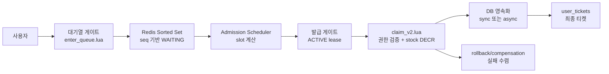
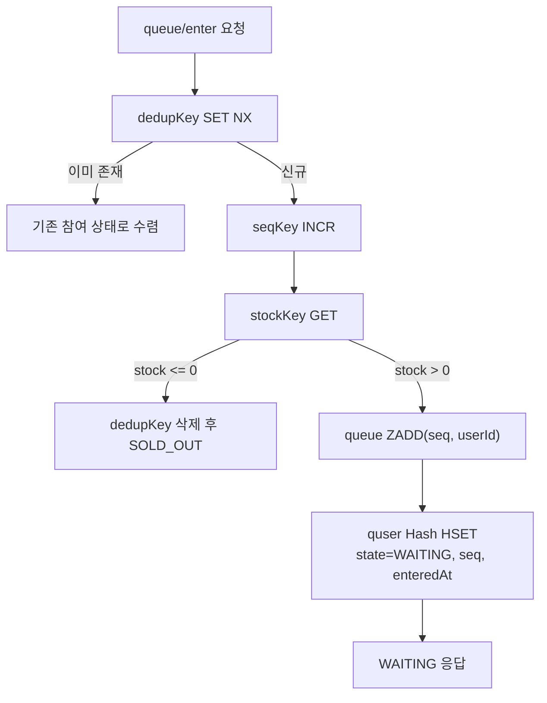
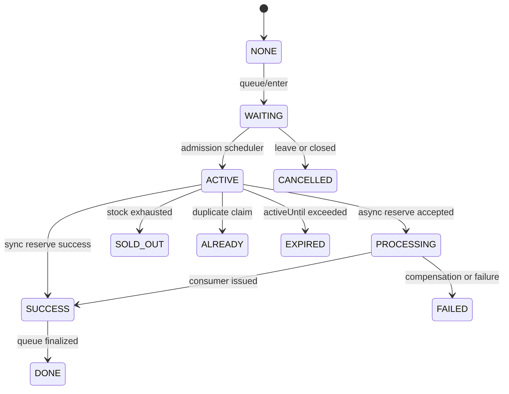
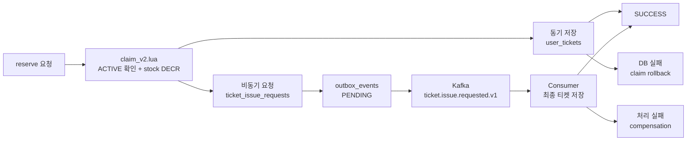
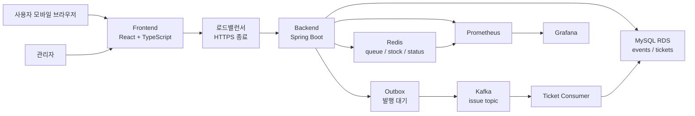
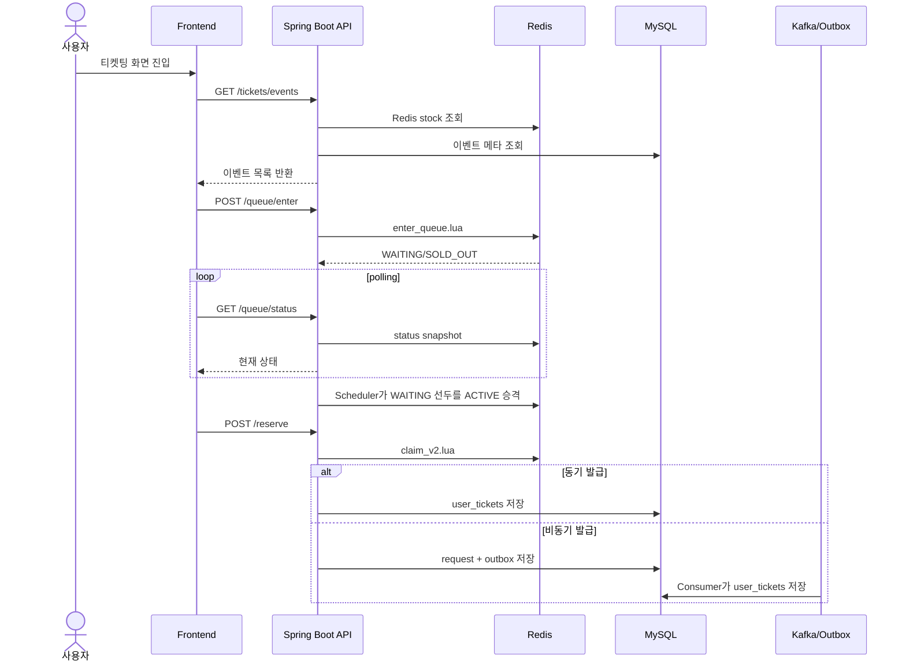
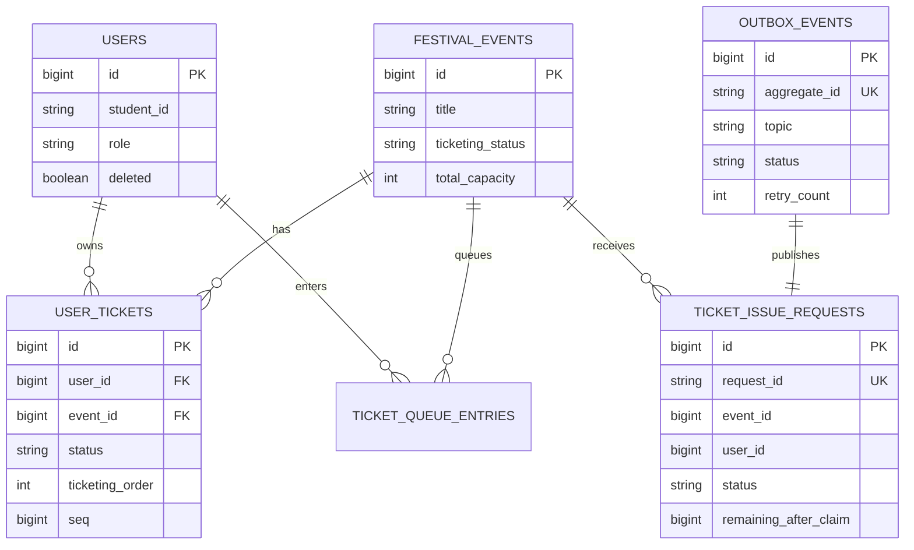

# 대학 축제 환경의 고동시성 티켓팅을 위한 Redis Lua 기반 이중 게이트 대기열 설계 및 정합성 검증

> 캡스톤 논문 v2 원고  
> 핵심 주장: DANZZAN 티켓팅의 기여는 단순한 Redis/Kafka 적용이 아니라, **대기열 게이트와 발급 게이트를 분리하고 각 경계의 불변식을 Lua 원자 연산으로 보장한 설계**에 있다.  
> 보안 기준: 토큰, pem, DB 접속 주소, 계정, 비밀번호, JWT secret 등 민감 정보는 본문에서 제외한다.

## 초록

대학 축제 티켓팅은 일반적인 온라인 예약과 달리 짧은 오픈 시점에 접속이 집중되고, 제한된 수량을 공정하게 배분해야 하며, 운영 현장에서는 초과 발급과 중복 발급이 허용되지 않는다. 단순 DB 트랜잭션 기반 예매 구조는 모든 사용자가 곧바로 재고 차감과 DB 저장 경로에 진입하기 때문에 커넥션 풀 경합, 중복 요청, 순번 불일치, tail latency 증가에 취약하다. 본 논문은 단국대학교 축제 통합 서비스 DANZZAN에서 이러한 문제를 해결하기 위해 Redis Lua 기반 **이중 게이트 대기열**을 설계하고 구현한 과정을 제시한다.

제안 구조는 사용자를 먼저 대기열 게이트에서 순번화한 뒤, 제한된 수의 사용자만 ACTIVE 슬롯으로 승격시켜 발급 게이트에 진입시키는 방식이다. 대기열 게이트는 Redis Sorted Set과 Lua Script를 이용하여 중복 진입 방지, 순번 발급, 대기열 삽입을 원자적으로 처리한다. 발급 게이트는 ACTIVE lease 검증, 중복 claim 방지, 재고 차감을 `claim_v2.lua` 하나의 원자 경계로 묶는다. 이후 동기 저장 또는 Outbox/Kafka 기반 비동기 발급 파이프라인을 통해 MySQL에 최종 티켓을 저장하며, 실패 시 rollback 및 compensation으로 Redis와 DB 상태를 회복한다.

본 연구의 평가는 평균 응답 시간만이 아니라 티켓팅 시스템의 핵심 불변식이 고동시성 상황에서도 유지되는지를 중심으로 수행하였다. 8,000명의 티켓팅 사용자, 1,000명의 배경 트래픽 사용자, 100명의 로그인 사용자를 포함한 총 9,100명 동시 접속 시나리오에서 재고 2,000장이 정확히 소진되었고, 중복 발급 0건, `ticketing_order` 1~2,000 연속성, 순번 중복 0건, 순번 gap 0건, Redis stock 0, 서버 TCP overflow/drop 0건을 확인하였다. 이 결과는 제안 구조가 대학 축제와 같은 단기 고집중 트래픽 환경에서 **성능보다 먼저 보장되어야 하는 정합성**을 유지하면서 운영 가능한 티켓팅 흐름을 제공함을 보여준다.

**주요어:** 고동시성 티켓팅, 이중 게이트 대기열, Redis Lua, 원자성, 정합성 검증, Outbox, Kafka

## 1. 서론

### 1.1 연구 배경

대학 축제 서비스는 행사 기간 동안만 폭발적으로 사용되는 특수한 서비스이다. 평상시에는 트래픽이 거의 없다가 공연 티켓 오픈 시점에는 수천 명의 사용자가 동시에 접속한다. 특히 축제 공연 티켓은 총 수량이 제한되어 있으므로, 시스템은 빠르게 응답하는 것뿐 아니라 **틀리지 않아야 한다**. 여기서 틀리지 않는다는 것은 재고보다 많은 티켓을 발급하지 않고, 같은 사용자에게 같은 이벤트의 티켓을 중복 발급하지 않으며, 선착순 순번이 중복되거나 누락되지 않는다는 뜻이다.

이 문제는 단순한 CRUD 구현 문제가 아니다. 티켓팅은 사용자 요청이 집중되는 시간대에 재고, 순번, 사용자 상태, 최종 DB 저장 결과가 동시에 변하는 분산 상태 관리 문제에 가깝다. 사용자가 새로고침하거나 동일 API를 반복 호출할 수 있고, 네트워크 지연 또는 DB 저장 실패가 발생할 수 있으며, 운영자는 티켓 발급 이후 팔찌 지급과 통계를 관리해야 한다. 따라서 대학 축제 티켓팅 시스템은 다음 조건을 동시에 만족해야 한다.

| 요구사항 | 설명 | 실패 시 영향 |
|---|---|---|
| 초과 발급 방지 | 총 발급 수량은 이벤트 capacity를 넘지 않아야 한다. | 현장 입장 혼란, 운영 신뢰도 저하 |
| 중복 발급 방지 | 사용자 1명은 이벤트 1개에 티켓 1장만 가져야 한다. | 공정성 훼손, 운영자 수동 정정 필요 |
| 순서 일관성 | 대기열 순번과 최종 발급 순번이 설명 가능해야 한다. | 선착순 논란, 사용자 불만 |
| 순간 부하 흡수 | 오픈 직후 폭주 요청이 DB를 직접 압박하지 않아야 한다. | 커넥션 풀 포화, 장애 전파 |
| 장애 회복 | Redis 차감과 DB 저장 사이 실패를 보상할 수 있어야 한다. | 재고와 발급 내역 불일치 |

### 1.2 연구 질문

본 논문은 다음 연구 질문에 답한다.

1. 대학 축제와 같이 짧은 시간에 접속이 집중되는 환경에서, 제한된 티켓 수량을 초과 발급 없이 처리하려면 어떤 요청 제어 구조가 필요한가?
2. Redis를 단순 캐시나 재고 카운터가 아니라 정합성 경계로 사용할 때, 어떤 불변식을 Lua Script 안에서 보장해야 하는가?
3. Redis에서 빠르게 claim한 결과를 MySQL 최종 티켓 발급으로 연결할 때, 장애와 중복 요청을 어떻게 수렴시켜야 하는가?
4. 고동시성 티켓팅 시스템의 평가는 단순 평균 응답 시간 외에 어떤 정합성 지표를 포함해야 하는가?

### 1.3 연구 기여

본 논문의 기여는 다음 네 가지로 정리된다.

1. **이중 게이트 대기열 구조 제안**: 모든 사용자가 곧바로 재고 차감에 접근하지 않도록, 대기열 게이트와 발급 게이트를 분리하였다. 대기열 게이트는 사용자 유입을 순번화하고, 발급 게이트는 ACTIVE 슬롯을 받은 사용자만 claim을 시도하게 한다.
2. **Lua 원자 경계 기반 불변식 보장**: 중복 진입 방지, 순번 발급, ACTIVE lease 검증, 중복 claim 방지, 재고 차감을 Redis Lua Script로 묶어 race condition을 줄였다.
3. **보상 가능한 최종 영속화 구조**: Redis claim 이후 DB 저장 또는 Kafka/Outbox 비동기 발급으로 이어지는 경로에서 실패 시 rollback과 compensation이 가능하도록 설계하였다.
4. **정합성 중심 평가 체계 제시**: 응답 시간뿐 아니라 발급 수량, 중복 발급, 순번 연속성, Redis 재고, 서버 overflow/drop을 함께 검증하여 고동시성 환경에서의 운영 가능성을 평가하였다.

## 2. 문제 정의와 기존 접근의 한계

### 2.1 축제 티켓팅 트래픽의 특성

대학 축제 티켓팅은 일반 쇼핑몰 결제나 상시 예약과 다른 트래픽 특성을 가진다.

| 특성 | 일반 서비스 | 대학 축제 티켓팅 |
|---|---|---|
| 사용 기간 | 지속적 | 행사 전후 단기간 집중 |
| 트래픽 분포 | 비교적 완만 | 오픈 시점에 급격한 spike |
| 실패 허용도 | 일부 재시도 가능 | 초과 발급과 중복 발급은 사실상 허용 불가 |
| 사용자 행위 | 탐색 후 구매 | 오픈 시각 대기 후 동시 진입 |
| 운영 후속 작업 | 배송/결제 처리 | 현장 팔찌 지급, 입장 확인, 통계 관리 |

따라서 이 시스템의 핵심은 단순히 평균 응답 시간을 낮추는 것이 아니다. 평균 응답 시간이 양호하더라도 재고가 초과 차감되거나 순번이 중복된다면 티켓팅 시스템으로는 실패한 것이다. 반대로 일부 요청의 응답 시간이 증가하더라도 재고와 순번의 정합성이 유지된다면 운영상 회복 가능성이 높다.

### 2.2 단순 DB 중심 방식의 한계

가장 단순한 방식은 사용자가 예매 버튼을 누를 때마다 DB에서 이미 발급된 티켓 수를 조회하고, 남은 수량이 있으면 `user_tickets` row를 삽입하는 구조이다. 이 방식은 구현이 쉽지만 고동시성 상황에서 다음 문제가 발생한다.

| 한계 | 원인 | 결과 |
|---|---|---|
| DB 커넥션 풀 경합 | 모든 사용자가 DB 조회/쓰기 경로에 직접 진입 | p95 지연 증가, timeout |
| race condition | 재고 확인과 저장 사이에 다른 요청이 개입 | 초과 발급 위험 |
| 중복 요청 처리 복잡성 | 새로고침, 재시도, 중복 클릭 | 같은 사용자의 상태가 흔들림 |
| 순번 설명 어려움 | DB insert 순서와 사용자 체감 순서가 불일치 가능 | 선착순 공정성 논란 |

초기 병목 분석에서도 `queue_enter`, `reserve`, `request_status`가 모두 DB 접근에 민감했고, 커넥션 풀 크기와 burst 쓰기 구간에서 tail latency가 증가할 수 있음이 확인되었다. 이 관찰은 대기열과 상태 조회, 재고 차감의 일부를 Redis 원자 경계로 옮겨야 하는 근거가 된다.

### 2.3 단순 Redis 재고 차감 방식의 한계

Redis의 `DECR`만 사용하면 재고 초과 차감은 비교적 쉽게 막을 수 있다. 그러나 축제 티켓팅에서는 이것만으로 충분하지 않다.

| 단순 Redis 차감으로 부족한 지점 | 필요한 추가 조건 |
|---|---|
| 사용자가 대기열을 통과했는지 알 수 없음 | ACTIVE lease 검증 |
| 같은 사용자가 반복 요청할 수 있음 | 사용자별 claim key |
| 재고 차감 후 DB 저장 실패 가능 | rollback/compensation |
| 대기열 순서와 발급 순서 연결이 약함 | sequence와 ticketing order 저장 |
| 모든 사용자가 동시에 claim 시도 가능 | admission 슬롯 제어 |

따라서 DANZZAN은 Redis를 단순한 재고 카운터로만 사용하지 않고, **대기열 상태와 발급 권한을 함께 검증하는 정합성 경계**로 사용한다.

### 2.4 보장해야 할 불변식

본 논문에서 제안 구조가 유지해야 하는 핵심 불변식은 다음과 같다.

| 불변식 | 설명 | 보장 위치 |
|---|---|---|
| I1. 재고 불변식 | 발급 성공 수량은 `total_capacity`를 초과하지 않는다. | `claim_v2.lua`, Redis stock |
| I2. 사용자 중복 불변식 | 한 사용자는 한 이벤트에 대해 한 번만 claim할 수 있다. | Redis userKey, DB unique |
| I3. 대기열 순번 불변식 | 대기열 진입 순번은 이벤트 단위로 단조 증가한다. | `enter_queue.lua`, Redis INCR |
| I4. 발급 권한 불변식 | ACTIVE lease가 없는 사용자는 reserve를 성공시킬 수 없다. | `claim_v2.lua`, active ZSet |
| I5. 최종 영속화 불변식 | Redis claim 결과는 DB 성공, 실패, 보상 중 하나로 수렴한다. | Outbox/Kafka, compensation |

이 불변식이 논문의 평가 기준이 된다. 즉, 본 시스템은 단순히 “Redis를 사용했기 때문에 빠르다”가 아니라, **각 불변식이 어느 경계에서 보장되는지 명확히 설계했다**는 점에서 차별성을 가진다.

## 3. 제안 방법: Redis Lua 기반 이중 게이트 대기열

### 3.1 전체 구조

제안 구조는 두 개의 게이트로 구성된다.

첫 번째는 **대기열 게이트**이다. 사용자는 티켓팅 오픈 시점에 바로 발급 로직으로 들어가지 않고 Redis 대기열에 진입한다. 이 단계에서 시스템은 사용자별 중복 진입을 막고, 이벤트 단위 sequence를 발급하며, Sorted Set에 사용자를 삽입한다.

두 번째는 **발급 게이트**이다. 스케줄러는 대기열 선두 사용자 중 일부만 ACTIVE 슬롯으로 승격한다. ACTIVE 사용자는 제한된 시간 안에 예매 확정을 시도할 수 있으며, 이때 `claim_v2.lua`가 ACTIVE lease, 중복 claim, Redis stock을 동시에 검증한다.

**그림 1. 제안하는 이중 게이트 티켓팅 구조**

이 구조의 핵심은 요청을 한 번에 모두 처리하지 않고, **대기열에서 순서를 만들고, 발급 게이트에서 처리량을 제한하고, claim 단계에서 정합성을 확정한다**는 점이다.

### 3.2 대기열 게이트

대기열 게이트는 `POST /tickets/{eventId}/queue/enter` API와 `enter_queue.lua`로 구현된다. 이 단계의 목표는 사용자의 오픈 직후 burst를 DB로 보내지 않고 Redis에서 순번화하는 것이다.

**그림 2. 대기열 게이트의 Lua 원자 처리**

이 단계에서 보장되는 것은 최종 발급이 아니라 **공정한 처리 후보의 순서화**이다. Redis `INCR`로 발급된 sequence는 대기열 순서를 설명할 수 있는 근거가 되며, `dedupKey`는 같은 사용자의 반복 진입을 같은 상태로 수렴시킨다.

### 3.3 발급 게이트와 ACTIVE lease

대기열에 들어온 모든 사용자가 동시에 reserve를 호출하면 Redis와 DB 모두에 burst가 전달된다. DANZZAN은 이를 막기 위해 ACTIVE 슬롯을 둔다. `TicketAdmissionScheduler`는 OPEN 상태 이벤트를 주기적으로 확인하고, 현재 ACTIVE 수, READY 수, Redis stock, 설정된 `max-concurrent-slots`, batch limit을 기준으로 대기열 선두 사용자를 ACTIVE로 승격한다.

ACTIVE는 단순한 UI 상태가 아니라 발급 권한이다. ACTIVE Hash에는 `activeAt`, `activeUntil`이 기록되고, ACTIVE ZSet에도 lease 만료 시각이 score로 저장된다. `claim_v2.lua`는 reserve 요청 시 Hash와 ZSet을 모두 확인하여 만료되었거나 ACTIVE가 아닌 사용자를 차단한다.

**그림 3. 사용자 상태 전이와 ACTIVE lease**

### 3.4 발급 게이트의 원자 경계

발급 게이트의 핵심은 `claim_v2.lua`이다. 이 스크립트는 다음 검증과 처리를 하나의 Redis 원자 연산으로 묶는다.

| 단계 | 처리 | 보장되는 불변식 |
|---|---|---|
| 1 | queueUserHash의 state가 ACTIVE인지 확인 | I4. 발급 권한 불변식 |
| 2 | activeUntil 및 ACTIVE ZSet score 확인 | I4. 발급 권한 불변식 |
| 3 | userKey 존재 여부 확인 | I2. 사용자 중복 불변식 |
| 4 | stockKey 값 확인 | I1. 재고 불변식 |
| 5 | `DECR stockKey` 실행 | I1. 재고 불변식 |
| 6 | userKey와 statusKey 저장 | I2. 사용자 중복 불변식 |

이 경계가 중요한 이유는 reserve 요청이 수천 개 동시에 들어와도 재고 확인과 차감 사이에 다른 요청이 끼어들 수 없기 때문이다. 또한 ACTIVE가 아닌 사용자는 stock을 차감할 수 없으므로, 대기열을 우회한 요청이 성공하지 않는다.

### 3.5 최종 영속화와 보상 가능한 일관성

Redis claim이 성공하면 시스템은 티켓 발급 권리를 확보한 것이다. 그러나 MySQL에 `user_tickets`를 저장하는 과정은 별도의 I/O와 트랜잭션을 포함하므로 실패 가능성이 있다. DANZZAN은 이를 두 가지 방식으로 처리한다.

| 경로 | 처리 방식 | 실패 대응 |
|---|---|---|
| 동기 발급 | claim 성공 후 같은 요청에서 `user_tickets` 저장 | DB 실패 시 claim rollback |
| 비동기 발급 | `ticket_issue_requests`와 `outbox_events` 저장 후 Kafka Consumer가 발급 | compensation으로 Redis/요청 상태 수렴 |

**그림 4. Redis claim 이후 최종 영속화 구조**

이 구조는 강한 동기 일관성만을 고집하지 않는다. 대신 사용자 응답성과 운영 복구 가능성을 고려하여, Redis claim 이후의 상태가 성공, 실패, 보상 중 하나로 수렴하도록 설계한다.

## 4. 구현

### 4.1 시스템 아키텍처

DANZZAN은 React 기반 프론트엔드와 Spring Boot 기반 백엔드로 구성된다. MySQL은 사용자, 이벤트, 최종 티켓을 저장하고, Redis는 대기열, 재고, 사용자별 티켓팅 상태를 관리한다. Kafka와 Outbox는 비동기 발급 경로에 사용되며, Prometheus/Grafana는 티켓팅 상태와 서버 지표를 관찰한다.

**그림 5. DANZZAN 티켓팅 중심 시스템 아키텍처**

### 4.2 핵심 API 흐름

티켓팅 API는 다음 흐름으로 구성된다.

| 단계 | API | 역할 |
|---|---|---|
| 이벤트 조회 | `GET /tickets/events` | 티켓팅 가능한 이벤트와 Redis stock 기반 잔여 수량 조회 |
| 대기열 진입 | `POST /tickets/{eventId}/queue/enter` | 대기열 게이트 진입 |
| 상태 조회 | `GET /tickets/{eventId}/queue/status` | WAITING/ADMITTED/PROCESSING/SUCCESS 상태 polling |
| 활성화 | `POST /tickets/{eventId}/activate` | ACTIVE 상태 확인 및 예매 단계 진입 |
| 예매 확정 | `POST /tickets/{eventId}/reserve` | 발급 게이트 claim 및 영속화 |
| 요청 상태 조회 | `GET /tickets/{eventId}/requests/{requestId}` | 비동기 발급 요청 상태 확인 |
| 내 티켓 조회 | `GET /tickets/me` | 최종 발급 티켓 조회 |

**그림 6. 티켓팅 API 시퀀스**

### 4.3 데이터 모델과 DB 방어선

Redis Lua가 1차 정합성 경계라면, MySQL unique constraint는 최종 방어선이다.

| 테이블 | 제약 | 목적 |
|---|---|---|
| `user_tickets` | `(user_id, event_id)` unique | 같은 사용자/이벤트 중복 티켓 방지 |
| `ticket_issue_requests` | `request_id` unique | 발급 요청 ID 중복 방지 |
| `ticket_issue_requests` | `(event_id, user_id)` unique | 사용자별 처리 요청 중복 방지 |
| `outbox_events` | `(aggregate_type, aggregate_id)` unique | 같은 요청의 이벤트 중복 발행 방지 |
| `ticket_queue_entries` | `(event_id, user_id)` unique | projection row 중복 방지 |

**그림 7. 티켓팅 중심 데이터 모델**

### 4.4 모니터링 구현

티켓팅 운영성을 위해 Micrometer 기반 도메인 메트릭을 구성하였다.

| 메트릭 | 의미 | 논문 평가와의 연결 |
|---|---|---|
| `ticket_queue_enter_total{result}` | 대기열 진입 결과 | WAITING/SOLD_OUT 분포 확인 |
| `ticket_claim_total{result}` | claim 결과 | SUCCESS/SOLD_OUT/ALREADY 검증 |
| `ticket_queue_depth{event_id}` | 실시간 대기열 깊이 | admission 처리 진행 상태 확인 |
| `ticket_stock_remaining{event_id}` | Redis 잔여 재고 | 재고 불변식 확인 |
| `ticket_admission_total{event_id}` | ACTIVE 승격 누적 수 | 게이트 처리량 확인 |

## 5. 평가 방법

### 5.1 평가 관점

본 논문의 평가는 성능과 정합성을 분리한다. 고동시성 티켓팅에서 평균 응답 시간은 중요하지만, 그것만으로 시스템의 성공을 판단할 수 없다. 따라서 본 연구는 다음 질문에 답하도록 평가를 설계하였다.

| 평가 질문 | 지표 |
|---|---|
| 재고보다 많이 발급되지 않았는가? | 발급 수량, Redis stock |
| 같은 사용자가 중복 발급되지 않았는가? | 중복 user count |
| 순번이 중복되거나 누락되지 않았는가? | `ticketing_order` 연속성, gap, duplicate |
| 매진 사용자가 정상 거부되었는가? | SOLD_OUT count |
| 서버가 연결 폭주를 견뎠는가? | FD, ESTAB, SYN_RECV, overflow/drop |
| 사용자 응답 시간은 운영 가능한 범위인가? | API별 평균, p95 |

### 5.2 실험 환경

부하 테스트는 실제 사용자 접근 경로와 유사하게 k6 클라이언트에서 HTTPS 로드밸런서를 거쳐 Spring Boot 서버로 요청하는 방식으로 수행하였다. 보안상 구체적인 IP, 계정, DB 주소는 제외한다.

| 구성 요소 | 설정 |
|---|---|
| 서버 | NHN Cloud 가상 서버, 8 vCPU, 15GB RAM |
| 애플리케이션 | Spring Boot Docker 컨테이너 |
| DB | MySQL 8.4 RDS |
| Redis | 서버 내부 Redis |
| Kafka | 내부망 Kafka, 3 partitions, 3 consumers |
| 로드밸런서 | HTTPS 종료, 연결 제한 60,000 |
| 클라이언트 | k6 |
| 모니터링 | Prometheus, Grafana, 서버 내부 네트워크 지표 |

### 5.3 실험 시나리오

주요 실험은 실제 축제 오픈 상황을 가정한 혼합 트래픽 시나리오이다.

| 시나리오 | VU 수 | 동작 |
|---|---:|---|
| 배경 트래픽 | 1,000 | 이벤트 목록을 2~5초 간격으로 조회 |
| 로그인 폭주 | 100 | 오픈 시점에 동시 로그인 |
| 티켓팅 | 8,000 | `queue/enter` → `queue/status` → `activate` → `reserve` |
| 합계 | 9,100 | 오픈 시점 혼합 트래픽 |

비교 실험으로 배경 트래픽이 없는 4,000명 full-flow 시나리오도 수행하였다. 테스트 이벤트의 총 재고는 2,000장이므로, 성공자는 최대 2,000명이어야 한다.

## 6. 평가 결과와 논의

### 6.1 정합성 결과

부하 테스트 후 정합성 검증 결과는 다음과 같다.

| 검증 항목 | 결과 | 해석 |
|---|---|---|
| 발급 수량 | 2,000장 | 총 capacity와 정확히 일치 |
| 중복 발급 | 0건 | 사용자 중복 불변식 유지 |
| 순번 연속성 | 1~2,000 연속 | 발급 순번 gap 없음 |
| 순번 중복 | 0건 | 동일 순번 중복 없음 |
| Redis 재고 | 0 | Redis stock과 DB 발급 수량 일치 |
| TCP overflow/drop | 0건 | 서버 측 연결 큐 overflow 없음 |

이 결과는 제안 구조가 논문에서 정의한 핵심 불변식 I1~I5를 실제 부하 상황에서도 유지했음을 의미한다. 특히 발급 수량이 capacity와 정확히 일치하고, 순번이 1부터 2,000까지 연속이라는 점은 Redis claim 결과와 DB 영속화 결과가 모순 없이 수렴했음을 보여준다.

### 6.2 응답 시간 결과

9,100명 동시 접속 시나리오의 응답 시간은 다음과 같다.

| 구간 | 평균 | p95 |
|---|---:|---:|
| background_poll | 121ms | 408ms |
| login | 4.06s | 6.87s |
| queue_enter | 498ms | 2.77s |
| queue_status | 1.21s | 2.68s |
| activate | 1.11s | 1.75s |
| reserve | 491ms | 861ms |

4,000명 full-flow 시나리오의 응답 시간은 다음과 같다.

| 구간 | 평균 | p95 |
|---|---:|---:|
| queue_enter | 1.79s | 6.54s |
| queue_status | 596ms | 1.71s |
| activate | 1.64s | 6.39s |
| reserve | 867ms | 2.14s |

응답 시간 결과만 보면 일부 구간의 p95는 개선 여지가 있다. 그러나 이 논문에서 중요한 해석은 tail latency가 존재하는 상황에서도 정합성 불변식이 깨지지 않았다는 점이다. 즉, 제안 구조는 “모든 요청을 가장 빠르게 처리하는 구조”라기보다, **부하를 통제하면서 틀리지 않게 처리하는 구조**이다.

### 6.3 서버 모니터링 결과

부하 테스트 중 서버 내부 지표는 다음과 같이 관찰되었다.

| 시점 | FD | ESTAB | SYN_RECV | OVERFLOW | DROPS |
|---|---:|---:|---:|---:|---:|
| 테스트 전 | 99 | 0 | 1 | 0 | 0 |
| 배경 진입 | 1,109 | 1,000 | 1 | 0 | 0 |
| 피크 | 4,429 | 4,289 | 1 | 0 | 0 |
| 종료 후 | 1,130 | 1,000 | 1 | 0 | 0 |

피크 시 FD는 4,429개였고, overflow/drop은 0건이었다. 이는 일부 connection reset이 서버 측 TCP 큐 overflow가 아니라 단일 k6 클라이언트가 대량 HTTPS 연결을 여는 과정에서 발생한 한계로 해석할 근거가 된다.

### 6.4 기존 병목 분석과의 연결

초기 로컬 300명 full-flow 병목 분석에서는 `queue_enter`, `queue_status`, `activate`, `reserve`, `request_status` 모두 목표 p95를 초과하였다.

| 구간 | 초기 관찰 p95 | 목표 | 병목 후보 |
|---|---:|---:|---|
| queue_enter | 2.42s | 500ms 미만 | DB 조회와 커넥션 풀 경합 |
| queue_status | 1.65s | 300ms 미만 | polling 누적 |
| activate | 1.41s | 500ms 미만 | 고부하 리소스 경합 |
| reserve | 1.70s | 700ms 미만 | DB 쓰기 및 Outbox 처리 |
| request_status | 959.57ms | 700ms 미만 | DB 기반 상태 조회 |

이 병목은 제안 구조의 방향을 정당화한다. 대기열 진입과 상태 조회에서 DB 접근을 줄이고, claim을 Redis Lua 경계로 이동하며, 최종 발급을 비동기화하는 설계는 병목 후보를 분리하기 위한 선택이다.

### 6.5 독창성 논의

본 시스템의 독창성은 개별 기술의 사용이 아니라 조합 방식과 정합성 경계 설정에 있다.

| 일반적 설명 | 본 논문의 차별점 |
|---|---|
| Redis로 재고를 차감했다 | ACTIVE lease가 있는 사용자만 차감할 수 있도록 발급 권한을 함께 검증했다. |
| 대기열을 만들었다 | 대기열 게이트와 발급 게이트를 분리하여 순번화와 claim 권한을 나누었다. |
| Kafka를 사용했다 | Redis claim 이후 DB 영속화 실패를 Outbox와 compensation으로 수렴시켰다. |
| 부하 테스트를 했다 | 평균 응답 시간보다 발급 수량, 중복 발급, 순번 gap 같은 정합성 지표를 핵심 평가로 삼았다. |

따라서 DANZZAN 티켓팅 구조는 단순한 오픈소스 기술 조합이 아니라, 축제 티켓팅이라는 문제의 특성에 맞춰 **공정성, 처리량 제어, 원자성, 보상 가능성**을 하나의 흐름으로 설계한 사례이다.

### 6.6 한계

본 연구에는 다음 한계가 있다.

1. 9,100명 부하 테스트는 단일 k6 클라이언트에서 수행되어, 일부 connection reset이 클라이언트 측 연결 한계로 발생하였다.
2. 실제 축제 사용자는 여러 기기와 네트워크에서 분산 접속하므로, 분산 부하 테스트가 추가로 필요하다.
3. 실사용 로그, 사용자 피드백, 운영자 피드백은 본 원고에 아직 충분히 통합되지 않았다.
4. Kafka lag, Outbox pending age, compensation retry의 장기 운영 지표 분석은 추가 과제로 남아 있다.
5. 본 논문은 시스템 설계와 정합성 검증에 초점을 두었으며, 프론트엔드 UX의 정량 평가는 별도 연구가 필요하다.

## 7. 결론

본 논문은 대학 축제 환경의 고동시성 티켓팅을 위해 Redis Lua 기반 이중 게이트 대기열 구조를 제안하고, 이를 DANZZAN 서비스에 구현한 결과를 제시하였다. 제안 구조는 대기열 게이트에서 사용자를 순번화하고, 발급 게이트에서 ACTIVE lease를 받은 사용자만 claim을 수행하게 하며, `claim_v2.lua`를 통해 ACTIVE 검증, 중복 claim 방지, 재고 차감을 하나의 원자 경계로 묶는다. 이후 MySQL 영속화와 Outbox/Kafka 비동기 발급, rollback/compensation을 통해 최종 상태를 수렴시킨다.

부하 테스트 결과, 총 9,100명 동시 접속 시나리오에서 재고 2,000장이 정확히 소진되었고, 중복 발급 0건, 순번 1~2,000 연속성, Redis stock 0, 서버 overflow/drop 0건을 확인하였다. 이는 제안 구조가 대학 축제와 같이 짧은 시간에 트래픽이 집중되는 환경에서 정합성을 유지하며 운영 가능한 티켓팅 흐름을 제공함을 보여준다.

향후에는 분산 k6 클라이언트 기반 재실험, 실제 운영 로그 분석, Kafka/Outbox 지표의 장기 관찰, 관리자 모니터링 대시보드 개선을 통해 본 구조의 운영 신뢰성을 더 정교하게 검증할 수 있다.

## 참고 근거

| 구분 | 파일 |
|---|---|
| 부하 테스트 결과 | `Danzzan-BE/docs/load-test-report.md` |
| 부하 테스트 재현 문서 | `Danzzan-BE/docs/ticket-queue-load-test-runbook.md` |
| 병목 분석 | `Danzzan-BE/docs/ticketing-bottleneck-issues-2026-04-17.md` |
| Redis 최적화 작업 | `Danzzan-BE/docs/queue-enter-redis-optimization-tasks.md` |
| 티켓팅 API | `src/main/java/com/danzzan/domain/ticket/controller/TicketController.java` |
| Redis key 설계 | `src/main/java/com/danzzan/domain/ticket/redis/TicketRedisKeys.java` |
| Lua Script | `src/main/resources/redis/*.lua` |
| 대기열 스케줄러 | `src/main/java/com/danzzan/domain/ticket/scheduler/TicketAdmissionScheduler.java` |
| Outbox/Kafka | `OutboxPublisherService.java`, `TicketIssueRequestedConsumer.java`, `TicketIssueConsumerService.java` |
| 티켓 엔티티 | `UserTicket.java`, `TicketIssueRequest.java`, `OutboxEvent.java`, `TicketQueueEntry.java` |
| 모니터링 | `TicketingMetrics.java`, `monitoring/prometheus.yml` |

## 부록 A. 최종 제출 전 보강 자료

| 자료 | 반영 위치 | 이유 |
|---|---|---|
| 팀 구성, 개발 기간, 지도교수 | 표지, 서론 | 캡스톤 제출 문서 요건 보강 |
| 실제 화면 캡처 | 4장 구현 | 서비스 완성도 제시 |
| Grafana 캡처 | 5장 평가 | 모니터링 근거 시각화 |
| k6 원본 summary | 5장 평가 | 수치 추적 가능성 확보 |
| 실사용 로그 또는 GA 지표 | 6장 논의 | 운영 검증 강화 |
| 외부 참고문헌 | 참고문헌 | Redis, Kafka, Outbox 관련 배경 보강 |

