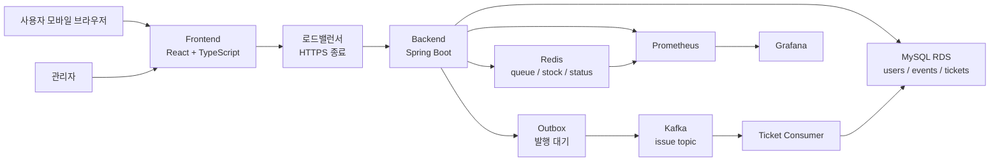
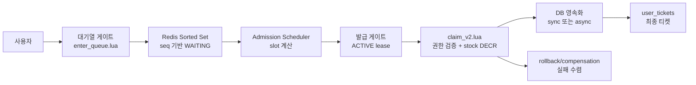
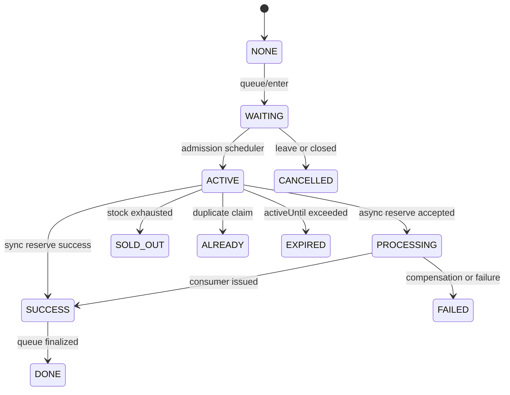
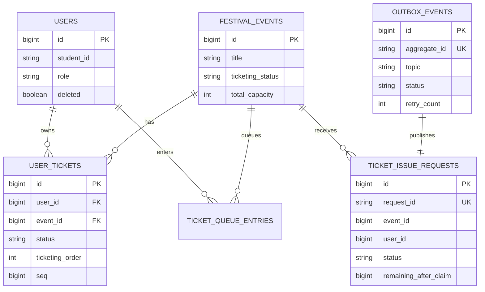
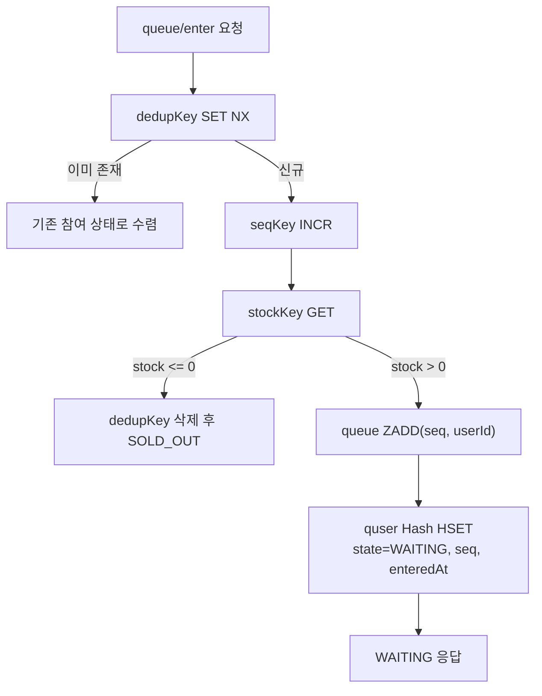
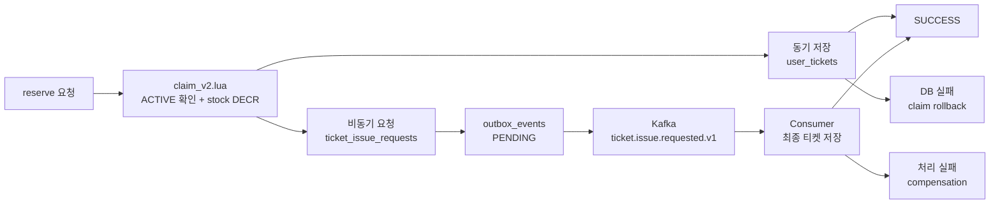
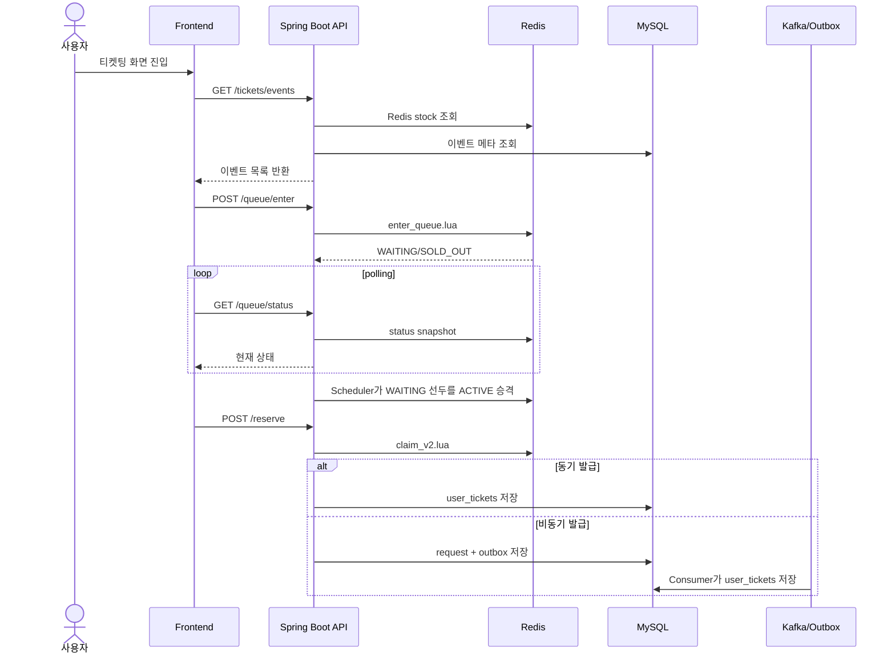

# DANZZAN 고동시성 티켓팅 시스템 캡스톤 결과 논문

> 캡스톤 논문 v3 원고  
> 구성 기준: 사용자가 지정한 `0. 표지`부터 `11. 결론`까지의 항목을 모두 반영한다.  
> 핵심 관점: 축제 통합 서비스라는 프로젝트 맥락을 충분히 설명하되, 기술적 독창성은 **Redis Lua 기반 이중 게이트 티켓팅 구조와 정합성 검증**으로 유지한다.

## 초록

DANZZAN은 단국대학교 축제 운영을 위해 홈, 공지, 부스맵, 타임테이블, 관리자 기능, 티켓팅 기능을 통합 제공하는 모바일 중심 웹 서비스이다. 본 프로젝트의 핵심 문제는 단순한 정보 제공을 넘어, 공연 티켓 오픈 시점에 발생하는 고동시성 요청을 공정하고 정확하게 처리하는 것이다. 대학 축제 티켓팅은 짧은 시간에 접속이 집중되고 티켓 수량이 제한되며, 초과 발급과 중복 발급이 허용되지 않는다는 점에서 일반적인 CRUD 서비스와 다르다.

본 논문은 DANZZAN의 프로젝트 배경, 요구사항, 기존 서비스 분석, 시스템 설계, 개발 환경, 주요 기능 구현, 구현 결과를 체계적으로 정리한다. 특히 티켓팅 도메인에서는 모든 사용자가 곧바로 재고 차감 경로로 진입하지 않도록 대기열 게이트와 발급 게이트를 분리한 **이중 게이트 구조**를 제안하였다. 대기열 게이트는 Redis Sorted Set과 Lua Script로 중복 진입 방지, 순번 발급, 대기열 삽입을 원자적으로 처리하고, 발급 게이트는 ACTIVE lease를 받은 사용자만 `claim_v2.lua`를 통해 재고 차감과 중복 claim 방지를 수행하도록 설계하였다. 이후 MySQL 영속화와 Outbox/Kafka 기반 비동기 발급, rollback/compensation 구조를 통해 실패 상황에서도 상태가 수렴하도록 하였다.

성능 및 정합성 검증에서는 8,000명의 티켓팅 사용자, 1,000명의 배경 트래픽 사용자, 100명의 로그인 사용자를 포함한 총 9,100명 동시 접속 시나리오를 수행하였다. 결과적으로 재고 2,000장이 정확히 소진되었고, 중복 발급 0건, `ticketing_order` 1~2,000 연속성, 순번 중복 0건, 순번 gap 0건, Redis stock 0, 서버 TCP overflow/drop 0건을 확인하였다. 이를 통해 DANZZAN은 축제 운영 기능과 고동시성 티켓팅 정합성을 함께 고려한 실사용형 캡스톤 프로젝트임을 보인다.

**주요어:** DANZZAN, 대학 축제 서비스, 고동시성 티켓팅, Redis Lua, 이중 게이트 대기열, 정합성 검증, Kafka, Outbox

## 1. 서론

### 1.1 프로젝트 주제 선정 배경

대학 축제는 짧은 기간 동안 많은 학생이 동시에 참여하는 행사이다. 축제 기간에는 공연 일정, 주점 위치, 긴급 공지, 이벤트 정보, 티켓팅 정보가 빠르게 변하고, 사용자는 모바일 환경에서 이를 즉시 확인하기를 기대한다. 그러나 축제 정보는 여러 채널에 흩어져 제공되는 경우가 많고, 운영자는 공지와 부스 정보, 공연 일정, 티켓 발급 상태를 별도 도구로 관리해야 하는 부담이 있다.

특히 공연 티켓팅은 축제 서비스에서 가장 높은 위험을 가진 기능이다. 티켓 수량은 제한되어 있고, 오픈 직후 많은 사용자가 동시에 접속한다. 이때 시스템이 단순히 요청 순서대로 DB에 접근하면 커넥션 풀 경합, 중복 요청, 초과 발급, 순번 불일치 문제가 발생할 수 있다. 축제 현장에서는 티켓 초과 발급이 곧 입장 혼란으로 이어지므로, 티켓팅은 “빠르게 처리하는 기능”이 아니라 “틀리지 않게 처리해야 하는 기능”으로 보아야 한다.

DANZZAN은 이러한 문제의식에서 출발하였다. 프로젝트의 목표는 축제 정보를 통합 제공하는 웹 서비스를 구현하는 동시에, 실제 축제 운영에서 사용할 수 있는 수준의 티켓팅 정합성과 관리자 운영 기능을 제공하는 것이다.

### 1.2 연구 및 개발 방향

본 프로젝트는 다음 질문을 중심으로 진행되었다.

1. 축제 정보, 부스맵, 타임테이블, 공지, 티켓팅, 관리자 기능을 하나의 서비스로 통합하려면 어떤 구조가 필요한가?
2. 오픈 시점에 수천 명이 동시에 접근하는 티켓팅에서 초과 발급과 중복 발급을 어떻게 방지할 수 있는가?
3. Redis, MySQL, Kafka, Outbox를 어떤 경계로 나누어야 성능과 정합성을 함께 확보할 수 있는가?
4. 구현 결과를 단순 기능 목록이 아니라 정량적 검증 결과로 어떻게 설명할 수 있는가?

## 2. 프로젝트 개요 및 개발 목적

### 2.1 프로젝트 개요

DANZZAN은 단국대학교 축제 정보를 제공하고 운영자가 축제 콘텐츠와 티켓을 관리할 수 있도록 만든 통합 웹 서비스이다. 프론트엔드는 React, TypeScript, Vite를 기반으로 구현되었고, 백엔드는 Spring Boot 기반 API 서버로 구성되었다. MySQL은 사용자, 이벤트, 티켓, 공지 등 영속 데이터를 저장하고, Redis는 티켓팅 대기열과 재고, 사용자 상태를 처리한다. Kafka와 Outbox는 비동기 티켓 발급 파이프라인을 구성하는 데 사용된다.

| 구분 | 내용 |
|---|---|
| 프로젝트명 | DANZZAN |
| 서비스 유형 | 대학 축제 통합 정보 및 티켓팅 서비스 |
| 주요 사용자 | 축제 참여 학생, 축제 운영자, 관리자 |
| 주요 기능 | 홈, 공지, 부스맵, 타임테이블, 티켓팅, 내 티켓, 관리자 |
| 핵심 기술 과제 | 고동시성 티켓팅에서 정합성 보장 |

### 2.2 개발 목적

본 프로젝트의 개발 목적은 세 가지이다.

첫째, 학생 사용자가 축제 정보를 한곳에서 확인할 수 있도록 한다. 홈 화면, 공지, 공연 일정, 부스맵, 티켓팅 상태가 분리되어 있으면 사용자는 필요한 정보를 찾기 어렵다. DANZZAN은 축제 참여에 필요한 정보를 모바일 중심 UI로 통합한다.

둘째, 운영자가 축제 콘텐츠와 티켓 상태를 관리할 수 있도록 한다. 공지, 광고, 부스, 타임테이블, 티켓 발급 상태를 관리자 화면에서 관리할 수 있어야 현장 운영 부담을 줄일 수 있다.

셋째, 공연 티켓팅에서 고동시성 요청을 공정하고 정확하게 처리한다. 본 프로젝트의 기술적 핵심은 Redis Lua 기반 이중 게이트 대기열 구조를 통해 재고 초과 발급과 중복 발급을 방지하는 것이다.

### 2.3 프로젝트의 기술적 핵심

정보 제공형 축제 서비스만 구현한다면 기술적 차별성은 제한적이다. DANZZAN의 기술적 핵심은 티켓팅 도메인에서 나타난다. 본 프로젝트는 다음 세 가지를 중심으로 설계되었다.

| 기술적 핵심 | 설명 |
|---|---|
| 이중 게이트 대기열 | 대기열 진입과 발급 권한 획득을 분리하여 순간 부하를 제어 |
| Lua 원자 경계 | 중복 진입, ACTIVE 검증, 재고 차감을 Redis Lua에서 원자 처리 |
| 보상 가능한 영속화 | Redis claim 이후 DB 저장 실패를 rollback/compensation으로 수렴 |

## 3. 요구사항 분석

### 3.1 사용자 요구사항

학생 사용자는 축제 정보를 빠르게 확인하고, 티켓팅 오픈 시점에 안정적으로 대기열에 진입하며, 예매 결과를 명확히 확인할 수 있어야 한다.

| 요구사항 | 설명 |
|---|---|
| 축제 정보 조회 | 홈, 공연 일정, 부스 위치, 공지를 모바일에서 확인 |
| 티켓팅 이벤트 조회 | 공연별 티켓 오픈 시간, 잔여 수량, 상태 확인 |
| 대기열 진입 | 오픈 시점에 대기열에 진입하고 현재 상태를 확인 |
| 예매 확정 | ACTIVE 상태에서 예매를 완료하고 결과를 확인 |
| 내 티켓 조회 | 예매 완료된 티켓과 팔찌 지급 상태 확인 |

### 3.2 관리자 요구사항

관리자는 축제 운영 정보를 등록하고 수정할 수 있어야 하며, 티켓 발급 이후 현장 팔찌 지급 업무를 처리할 수 있어야 한다.

| 요구사항 | 설명 |
|---|---|
| 공지 관리 | 긴급 공지 및 일반 공지 생성/수정/삭제 |
| 부스맵 관리 | 부스와 주점 정보, 일자별 노출 정보 관리 |
| 타임테이블 관리 | 공연 일정, 아티스트, 표시 설정 관리 |
| 티켓 관리 | 발급된 티켓 조회, 팔찌 지급/취소 처리 |
| 운영 통계 | 티켓 발급 수량, 지급 완료 수량, 미지급 수량 확인 |

### 3.3 비기능 요구사항

티켓팅 도메인에서는 비기능 요구사항이 기능 요구사항만큼 중요하다.

| 요구사항 | 설명 | 검증 지표 |
|---|---|---|
| 정합성 | 재고와 DB 발급 수량이 일치해야 함 | 발급 수량, Redis stock |
| 중복 방지 | 같은 사용자가 같은 이벤트를 중복 예매할 수 없어야 함 | 중복 사용자 수 |
| 순서 보장 | 대기열 진입 순번과 발급 순번이 설명 가능해야 함 | 순번 중복, 순번 gap |
| 부하 제어 | 모든 사용자가 동시에 DB 저장 경로에 진입하지 않아야 함 | p95, FD, overflow/drop |
| 장애 회복 | claim 이후 DB 실패가 발생해도 상태가 수렴해야 함 | rollback, compensation |

### 3.4 티켓팅 불변식

본 시스템이 반드시 유지해야 하는 불변식은 다음과 같다.

| 불변식 | 설명 | 보장 위치 |
|---|---|---|
| I1. 재고 불변식 | 발급 성공 수량은 총 capacity를 초과하지 않는다. | Redis stock, `claim_v2.lua` |
| I2. 사용자 중복 불변식 | 한 사용자는 한 이벤트에 한 장만 발급받는다. | Redis userKey, DB unique |
| I3. 순번 불변식 | 발급 순번은 중복과 gap 없이 연속되어야 한다. | Redis DECR 결과, DB 저장 |
| I4. 권한 불변식 | ACTIVE 권한이 없는 사용자는 reserve를 성공시킬 수 없다. | ACTIVE ZSet, `claim_v2.lua` |
| I5. 수렴 불변식 | claim 이후 상태는 성공, 실패, 보상 중 하나로 수렴한다. | Outbox, Kafka, compensation |

## 4. 기존 서비스 분석

### 4.1 기존 축제 정보 제공 방식의 한계

기존 축제 정보는 SNS, 웹 페이지, 포스터, 단과대별 공지 등 여러 채널에 흩어져 제공되는 경우가 많다. 이런 방식은 사용자가 정보를 찾는 데 시간이 걸리고, 정보가 수정되었을 때 최신 상태를 보장하기 어렵다. 또한 운영자는 각 채널을 따로 관리해야 하므로 공지 누락이나 중복 공지가 발생할 수 있다.

### 4.2 기존 티켓팅 방식의 한계

단순 선착순 신청폼이나 DB 중심 티켓팅 방식은 구현이 쉽지만, 고동시성 상황에서는 다음 문제가 발생한다.

| 방식 | 장점 | 한계 |
|---|---|---|
| 신청폼 방식 | 구현이 단순하고 빠르게 배포 가능 | 순번, 재고, 중복 요청 제어가 약함 |
| DB 트랜잭션 중심 방식 | 영속 저장과 정합성을 DB에서 관리 | 오픈 시점 DB 커넥션 풀 경합 발생 |
| 단순 Redis 재고 차감 방식 | 재고 초과 차감 방지에 유리 | 대기열 통과 여부와 DB 실패 보상이 부족 |
| 외부 티켓팅 플랫폼 | 검증된 기능 제공 | 학교 축제 운영 흐름, 관리자 팔찌 지급, 서비스 통합에 제약 |

### 4.3 DANZZAN의 차별점

DANZZAN은 단순히 축제 정보를 보여주는 서비스가 아니라, 축제 운영과 티켓팅 정합성을 함께 고려한다. 특히 티켓팅에서는 Redis를 단순 캐시로 쓰지 않고, 대기열과 발급 권한을 검증하는 정합성 경계로 사용한다.

| 일반적 설명 | DANZZAN의 차별점 |
|---|---|
| Redis로 재고를 관리 | ACTIVE lease가 있는 사용자만 재고 차감 가능 |
| 대기열 제공 | 대기열 게이트와 발급 게이트를 분리 |
| Kafka 사용 | claim 이후 DB 저장 실패를 Outbox/compensation으로 수렴 |
| 부하 테스트 수행 | 응답 시간뿐 아니라 중복 발급, 순번 gap, Redis stock 검증 |

## 5. 시스템 설계

### 5.1 전체 아키텍처

DANZZAN은 프론트엔드, 백엔드, MySQL, Redis, Kafka, Prometheus/Grafana로 구성된다. 프론트엔드는 사용자와 관리자의 화면을 제공하고, 백엔드는 도메인별 API를 제공한다. Redis는 티켓팅 대기열과 재고 상태를 처리하며, Kafka/Outbox는 비동기 티켓 발급을 담당한다.

**그림 1. DANZZAN 전체 시스템 아키텍처**

### 5.2 티켓팅 이중 게이트 설계

티켓팅은 대기열 게이트와 발급 게이트로 나뉜다. 대기열 게이트는 사용자를 순번화하고, 발급 게이트는 ACTIVE lease를 받은 사용자만 재고 차감을 시도하게 한다.

**그림 2. Redis Lua 기반 이중 게이트 티켓팅 구조**

### 5.3 상태 모델

티켓팅 상태는 사용자에게 반환되는 상태와 Redis 내부 큐 상태로 구분된다. 사용자 응답 상태는 `WAITING`, `ADMITTED`, `PROCESSING`, `SUCCESS`, `FAILED`, `SOLD_OUT`, `ALREADY` 등으로 표현되며, Redis 내부 상태는 `WAITING`, `ACTIVE`, `DONE`, `EXPIRED`, `CANCELLED` 등을 가진다.

**그림 3. 티켓팅 상태 전이 모델**

### 5.4 데이터 모델

티켓팅의 핵심 테이블은 `festival_events`, `user_tickets`, `ticket_issue_requests`, `outbox_events`, `ticket_queue_entries`이다. Redis가 실시간 처리 경로를 담당하고, MySQL은 최종 발급 결과와 운영 이력을 저장한다.

**그림 4. 티켓팅 중심 데이터 모델**

## 6. 개발 환경

### 6.1 프론트엔드 개발 환경

| 항목 | 내용 |
|---|---|
| 언어 | TypeScript |
| 프레임워크 | React 18 |
| 빌드 도구 | Vite |
| 상태/서버 상태 | TanStack Query, 도메인별 hook |
| 스타일 | Tailwind CSS 기반 스타일링 |
| 품질 검증 | ESLint, TypeScript typecheck, Vitest |

프론트엔드는 일반 앱 도메인과 티켓팅 도메인을 분리하여 유지보수성을 높였다. 예를 들어 `src/api/app`, `src/api/ticketing`, `src/routes/ticketing`, `src/hooks/ticketing`처럼 도메인 경계를 명확히 두었다.

### 6.2 백엔드 개발 환경

| 항목 | 내용 |
|---|---|
| 언어 | Java 17 |
| 프레임워크 | Spring Boot 3.5 |
| DB | MySQL 8.4 |
| Cache/Queue | Redis |
| Messaging | Kafka |
| ORM | Spring Data JPA |
| 인증 | Spring Security, JWT |
| 모니터링 | Spring Boot Actuator, Micrometer, Prometheus |
| 테스트/빌드 | Gradle, JUnit |

### 6.3 부하 테스트 및 운영 환경

| 구성 요소 | 설정 |
|---|---|
| 서버 | NHN Cloud 가상 서버, 8 vCPU, 15GB RAM |
| 애플리케이션 | Spring Boot Docker 컨테이너 |
| DB | MySQL RDS |
| Redis | 서버 내부 Redis |
| Kafka | 내부망 Kafka, 3 partitions, 3 consumers |
| 로드밸런서 | HTTPS 종료, 연결 제한 60,000 |
| 부하 테스트 | k6 |
| 모니터링 | Prometheus, Grafana |

## 7. 주요 기능 구현

### 7.1 사용자 기능

사용자 기능은 축제 정보 탐색과 티켓팅 참여를 중심으로 구현되었다.

| 기능 | 구현 내용 |
|---|---|
| 홈 화면 | 축제 주요 정보, 긴급 공지, 공연 정보 제공 |
| 공지 조회 | 일반 공지와 긴급 공지 조회 |
| 부스맵 | 부스/주점 위치와 일자별 노출 정보 제공 |
| 타임테이블 | 공연 일정과 아티스트 정보 제공 |
| 티켓팅 | 이벤트 조회, 대기열 진입, 상태 polling, 예매 확정 |
| 내 티켓 | 발급된 티켓과 팔찌 지급 상태 조회 |

### 7.2 관리자 기능

관리자 기능은 축제 운영자가 행사 정보를 수정하고 티켓 상태를 관리할 수 있도록 구성되었다.

| 기능 | 구현 내용 |
|---|---|
| 공지 관리 | 일반 공지, 긴급 공지 생성/수정/삭제 |
| 부스맵 관리 | 주점 정보, 일자별 노출, 이미지 관리 |
| 타임테이블 관리 | 공연 일정, 아티스트, 표시 설정 관리 |
| 티켓 관리 | 사용자 티켓 조회, 팔찌 지급, 지급 취소 |
| 광고 관리 | 홈 광고 정보 등록 및 수정 |

### 7.3 대기열 진입 구현

대기열 진입은 `enter_queue.lua`로 처리한다. 이 스크립트는 `dedupKey SET NX`, `seqKey INCR`, `stockKey GET`, `queue ZADD`, `quser Hash HSET`을 하나의 원자 경계로 묶는다.

**그림 5. 대기열 진입 Lua 처리**

### 7.4 예매 확정 구현

예매 확정은 `claim_v2.lua`로 처리한다. 이 스크립트는 ACTIVE 상태와 lease를 확인한 뒤, 이미 claim한 사용자인지 확인하고, Redis stock이 남아 있으면 `DECR`로 재고를 차감한다.

| 검증/처리 | 목적 |
|---|---|
| `queueState == ACTIVE` 확인 | 대기열을 통과하지 않은 사용자 차단 |
| `activeUntil` 확인 | 만료된 권한 차단 |
| userKey 확인 | 중복 claim 방지 |
| stock 확인 | 매진 이후 발급 방지 |
| stock `DECR` | 재고 차감 원자 처리 |
| statusKey 저장 | 사용자별 결과 상태 기록 |

### 7.5 비동기 발급과 보상 처리

Redis claim 이후 DB 저장은 동기 또는 비동기 경로로 처리된다. 비동기 경로에서는 `ticket_issue_requests`와 `outbox_events`를 저장하고, Outbox Publisher가 Kafka로 이벤트를 발행하며, Consumer가 최종적으로 `user_tickets`를 저장한다.

**그림 6. 비동기 발급 및 보상 처리 구조**

### 7.6 티켓팅 API 흐름

**그림 7. 티켓팅 API 시퀀스**

## 8. 구현 결과

### 8.1 기능 구현 결과

프로젝트 결과로 사용자용 축제 서비스와 관리자 운영 기능이 구현되었다. 프론트엔드는 일반 앱 영역과 티켓팅 영역을 분리하여 구성했고, 백엔드는 도메인별 Controller, Service, Repository를 기반으로 API를 제공한다.

| 영역 | 구현 결과 |
|---|---|
| 사용자 앱 | 홈, 공지, 부스맵, 타임테이블, 티켓팅, 내 티켓 |
| 관리자 | 공지, 부스맵, 타임테이블, 광고, 티켓 지급 관리 |
| 티켓팅 | 대기열, 상태 polling, ACTIVE 승격, 예매 확정, 비동기 발급 |
| 모니터링 | Prometheus metric, Redis queue depth, stock, claim result |

### 8.2 부하 테스트 결과

9,100명 동시 접속 시나리오의 응답 시간은 다음과 같다.

| 구간 | 평균 | p95 |
|---|---:|---:|
| background_poll | 121ms | 408ms |
| login | 4.06s | 6.87s |
| queue_enter | 498ms | 2.77s |
| queue_status | 1.21s | 2.68s |
| activate | 1.11s | 1.75s |
| reserve | 491ms | 861ms |

4,000명 full-flow 시나리오의 응답 시간은 다음과 같다.

| 구간 | 평균 | p95 |
|---|---:|---:|
| queue_enter | 1.79s | 6.54s |
| queue_status | 596ms | 1.71s |
| activate | 1.64s | 6.39s |
| reserve | 867ms | 2.14s |

### 8.3 정합성 검증 결과

| 검증 항목 | 결과 | 해석 |
|---|---|---|
| 발급 수량 | 2,000장 | 총 capacity와 정확히 일치 |
| 중복 발급 | 0건 | 사용자 중복 불변식 유지 |
| 순번 연속성 | 1~2,000 연속 | 발급 순번 gap 없음 |
| 순번 중복 | 0건 | 동일 순번 중복 없음 |
| Redis 재고 | 0 | Redis stock과 DB 발급 수량 일치 |
| TCP overflow/drop | 0건 | 서버 측 연결 큐 overflow 없음 |

### 8.4 서버 모니터링 결과

| 시점 | FD | ESTAB | SYN_RECV | OVERFLOW | DROPS |
|---|---:|---:|---:|---:|---:|
| 테스트 전 | 99 | 0 | 1 | 0 | 0 |
| 배경 진입 | 1,109 | 1,000 | 1 | 0 | 0 |
| 피크 | 4,429 | 4,289 | 1 | 0 | 0 |
| 종료 후 | 1,130 | 1,000 | 1 | 0 | 0 |

## 9. 기대 효과

### 9.1 사용자 측면

사용자는 축제 정보를 여러 채널에서 찾지 않고 하나의 서비스에서 확인할 수 있다. 티켓팅에서는 대기열 상태와 예매 결과를 명확히 확인할 수 있으므로, 오픈 시점의 혼란을 줄일 수 있다.

### 9.2 운영자 측면

운영자는 공지, 부스, 타임테이블, 티켓 지급 상태를 관리자 화면에서 관리할 수 있다. 특히 티켓 발급 이후 팔찌 지급 상태를 관리할 수 있어 현장 운영 업무를 줄일 수 있다.

### 9.3 기술적 측면

Redis Lua 기반 이중 게이트 구조는 축제 티켓팅처럼 단기 고집중 트래픽이 발생하는 서비스에 적용할 수 있는 설계 사례가 된다. 이 구조는 단순히 빠른 처리를 목표로 하지 않고, 재고와 순번, 사용자 중복 상태의 정합성을 유지하는 데 초점을 둔다.

| 기대 효과 | 설명 |
|---|---|
| 공정성 강화 | 대기열 sequence와 ACTIVE 승격으로 선착순 흐름 설명 가능 |
| 정합성 보장 | Lua 원자 경계와 DB unique 제약으로 중복/초과 발급 방지 |
| 운영 안정성 | rollback/compensation으로 실패 상태 수렴 |
| 확장 가능성 | 이벤트별 Redis key와 scheduler 설정으로 다른 행사에 적용 가능 |

## 10. 한계점 및 향후 개선 방향

### 10.1 한계점

본 프로젝트에는 다음 한계가 있다.

1. 9,100명 부하 테스트는 단일 k6 클라이언트에서 수행되어 일부 connection reset이 클라이언트 측 한계로 발생하였다.
2. 실제 사용자는 여러 네트워크와 기기에서 분산 접속하므로, 분산 부하 테스트가 추가로 필요하다.
3. 실사용 로그, 사용자 피드백, 운영자 피드백은 아직 충분히 논문에 통합되지 않았다.
4. Kafka lag, Outbox pending age, compensation retry의 장기 운영 지표 분석이 부족하다.
5. 프론트엔드 UX와 접근성은 기능 검증 중심으로 확인되었고, 별도 정량 평가는 수행되지 않았다.

### 10.2 향후 개선 방향

| 개선 방향 | 설명 |
|---|---|
| 분산 부하 테스트 | 여러 클라이언트에서 실제 사용자 환경과 유사하게 재실험 |
| 운영 대시보드 고도화 | queue depth, stock, claim result, outbox pending age 시각화 |
| 실사용 로그 분석 | 실제 접속량, 이탈률, 예매 성공률, 오류 원인 분석 |
| 관리자 기능 개선 | compensation 상태와 장애 알림을 관리자 화면에 제공 |
| UX 개선 | 예상 대기 시간, 실패 복구 안내, 접근성 라벨 강화 |

## 11. 결론

DANZZAN은 대학 축제 운영을 위한 통합 웹 서비스로, 축제 정보 제공과 관리자 운영 기능, 고동시성 티켓팅 기능을 함께 구현하였다. 본 프로젝트의 핵심 기술 과제는 공연 티켓팅 오픈 시점에 발생하는 순간 트래픽을 처리하면서도 초과 발급과 중복 발급을 방지하는 것이었다.

이를 위해 Redis Lua 기반 이중 게이트 대기열 구조를 설계하였다. 대기열 게이트는 사용자를 순번화하고, 발급 게이트는 ACTIVE lease를 받은 사용자만 claim을 수행하도록 제한한다. `claim_v2.lua`는 ACTIVE 검증, 중복 claim 방지, 재고 차감을 원자적으로 처리하며, 이후 MySQL 영속화와 Outbox/Kafka 비동기 발급, rollback/compensation을 통해 최종 상태를 수렴시킨다.

부하 테스트 결과, 총 9,100명 동시 접속 시나리오에서 재고 2,000장이 정확히 소진되었고, 중복 발급 0건, 순번 1~2,000 연속성, Redis stock 0, 서버 overflow/drop 0건을 확인하였다. 따라서 DANZZAN은 단순한 축제 정보 서비스가 아니라, 실제 축제 운영에서 요구되는 정합성과 운영성을 고려한 캡스톤 프로젝트로 평가할 수 있다.

## 참고 근거

| 구분 | 파일 |
|---|---|
| 부하 테스트 결과 | `Danzzan-BE/docs/load-test-report.md` |
| 부하 테스트 재현 문서 | `Danzzan-BE/docs/ticket-queue-load-test-runbook.md` |
| 병목 분석 | `Danzzan-BE/docs/ticketing-bottleneck-issues-2026-04-17.md` |
| Redis 최적화 작업 | `Danzzan-BE/docs/queue-enter-redis-optimization-tasks.md` |
| 티켓팅 API | `src/main/java/com/danzzan/domain/ticket/controller/TicketController.java` |
| Redis key 설계 | `src/main/java/com/danzzan/domain/ticket/redis/TicketRedisKeys.java` |
| Lua Script | `src/main/resources/redis/*.lua` |
| 대기열 스케줄러 | `src/main/java/com/danzzan/domain/ticket/scheduler/TicketAdmissionScheduler.java` |
| Outbox/Kafka | `OutboxPublisherService.java`, `TicketIssueRequestedConsumer.java`, `TicketIssueConsumerService.java` |
| 티켓 엔티티 | `UserTicket.java`, `TicketIssueRequest.java`, `OutboxEvent.java`, `TicketQueueEntry.java` |
| 모니터링 | `TicketingMetrics.java`, `monitoring/prometheus.yml` |

