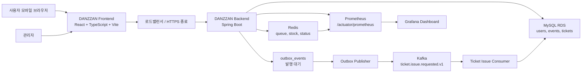
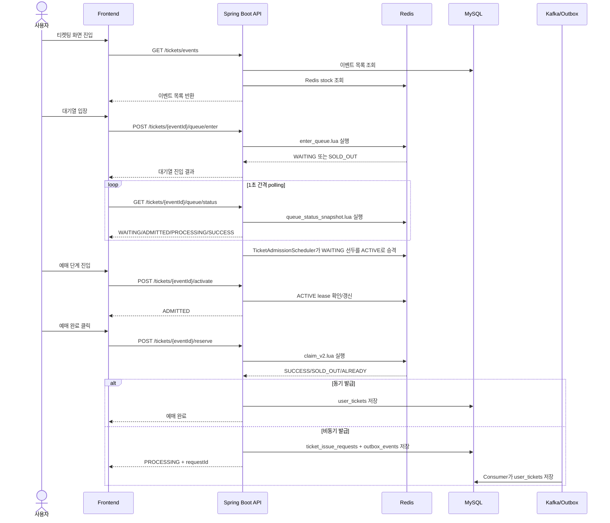
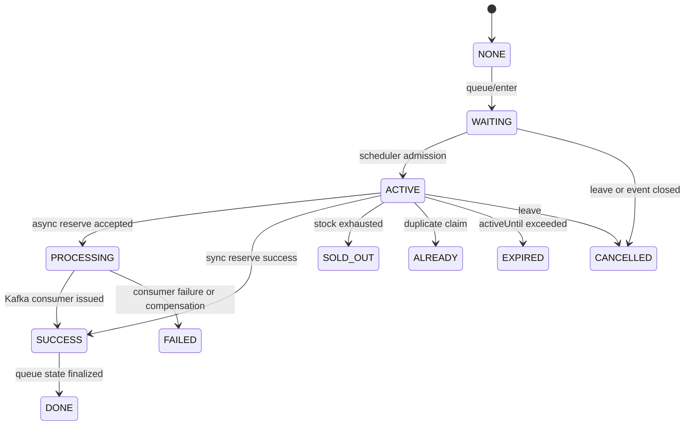
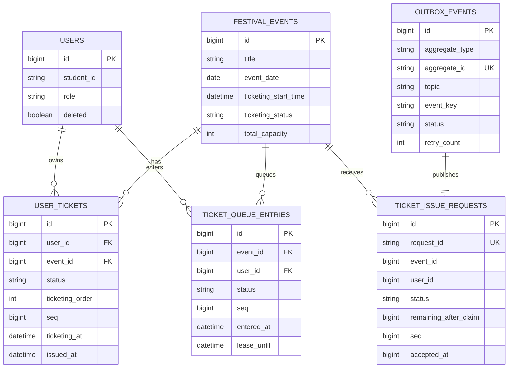
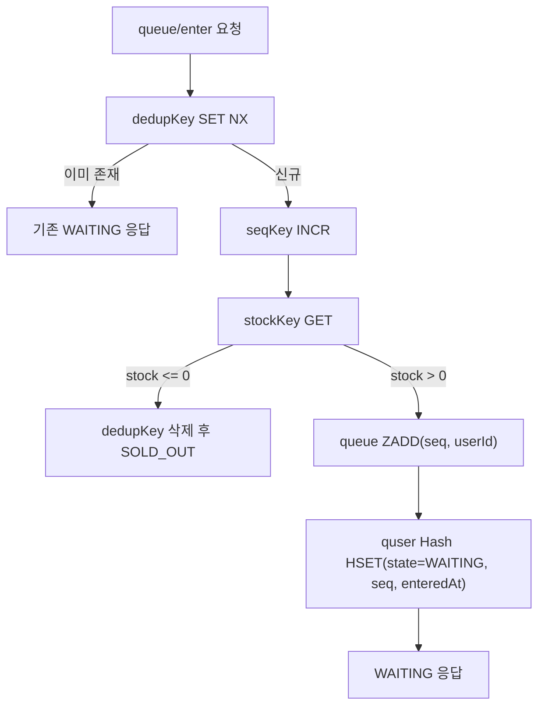
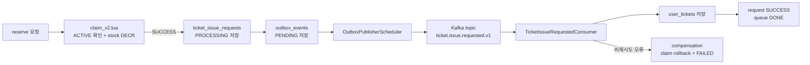

# DANZZAN 고동시성 티켓팅 시스템 설계 및 구현

> 캡스톤 논문 초안  
> 주제: Redis Lua 기반 대기열과 티켓 발급 정합성 보장  
> 작성 기준: 레포 내 코드, 아키텍처 문서, 부하 테스트 보고서 기반  
> 보안 기준: 토큰, pem, DB 접속 주소, 계정, 비밀번호, JWT secret 등 민감 정보는 본문에서 제외한다.

## 초록

대학 축제 서비스는 짧은 기간 동안 집중적으로 사용되며, 특히 공연 티켓팅과 같이 수량이 제한된 기능에서는 다수 사용자의 동시 요청을 공정하고 일관되게 처리해야 한다. 단순히 관계형 데이터베이스 트랜잭션에 의존하는 방식은 동시 접속 폭주 상황에서 커넥션 풀 경합, 중복 요청, 초과 발급, 순번 불일치와 같은 문제가 발생할 수 있다. 본 논문은 단국대학교 축제 통합 서비스인 DANZZAN에서 고동시성 티켓팅을 처리하기 위해 Redis Sorted Set 기반 대기열, Redis Lua Script 기반 원자 연산, ACTIVE 슬롯 제어, Kafka 및 Outbox 기반 비동기 발급 파이프라인을 설계하고 구현한 과정을 정리한다.

제안 시스템은 사용자를 대기열에 진입시킨 뒤, 서버가 설정한 동시 처리 슬롯만큼 순차적으로 ACTIVE 상태로 승격하고, 예매 확정 시 Redis Lua Script로 활성 상태 검증, 중복 발급 방지, 재고 차감을 하나의 원자 연산으로 처리한다. 이후 동기 저장 또는 비동기 발급 파이프라인을 통해 MySQL에 최종 티켓을 저장한다. 부하 테스트에서는 8,000명의 티켓팅 사용자, 1,000명의 배경 트래픽 사용자, 100명의 로그인 사용자를 포함한 총 9,100명 동시 접속 시나리오를 구성하였다. 실험 결과, 재고 2,000장이 정확히 소진되었고 중복 발급 0건, 티켓 순번 1~2,000 연속성, Redis 재고 0, 서버 TCP overflow/drop 0건을 확인하였다. 이를 통해 DANZZAN 티켓팅 구조가 대학 축제와 같은 단기 고집중 트래픽 환경에서 정합성과 운영 가능성을 확보할 수 있음을 보인다.

**주요어:** 고동시성 티켓팅, Redis, Lua Script, 대기열, 원자성, Kafka, Outbox, 부하 테스트

## 1. 서론

### 1.1 연구 배경

대학 축제 서비스는 행사 안내, 공연 시간표, 부스 정보, 공지사항, 티켓팅, 관리자 운영 기능을 하나의 모바일 중심 서비스로 제공해야 한다. 이 중 티켓팅은 가장 높은 기술적 위험을 가진 기능이다. 티켓은 수량이 제한되어 있으며, 오픈 시점 직후 사용자가 동시에 접근한다. 따라서 시스템은 다음 요구사항을 만족해야 한다.

| 요구사항 | 설명 |
|---|---|
| 공정성 | 먼저 대기열에 들어온 사용자가 먼저 처리되어야 한다. |
| 원자성 | 재고 차감과 중복 발급 방지가 경쟁 조건 없이 수행되어야 한다. |
| 정합성 | DB 최종 발급 수량, Redis 재고, 사용자별 티켓 보유 상태가 서로 모순되지 않아야 한다. |
| 가용성 | 티켓팅 중에도 홈, 공지, 이벤트 목록 같은 배경 트래픽을 처리할 수 있어야 한다. |
| 운영성 | 관리자와 운영자가 티켓 발급 상태, 팔찌 지급 상태, 장애 상황을 추적할 수 있어야 한다. |

기존의 단순한 구현에서는 사용자가 예매 버튼을 누를 때마다 DB를 조회하고 티켓 row를 삽입하는 방식이 사용될 수 있다. 그러나 동시 요청이 수천 건 이상 몰리는 경우 DB 커넥션 풀이 포화되고, 락 경합이 증가하며, 중복 요청에 대한 처리가 복잡해진다. 또한 사용자가 새로고침하거나 같은 요청을 반복 호출할 때 동일 사용자의 상태를 안정적으로 수렴시키는 문제가 발생한다.

### 1.2 연구 목표

본 연구의 목표는 DANZZAN 서비스에서 대학 축제 티켓팅 요구사항을 만족하는 고동시성 티켓팅 시스템을 설계하고, 구현 결과를 부하 테스트로 검증하는 것이다. 구체적인 목표는 다음과 같다.

1. Redis 기반 대기열로 순간 유입 요청을 흡수한다.
2. Lua Script를 사용하여 대기열 진입, ACTIVE 승격, 재고 차감, 중복 발급 방지를 원자적으로 처리한다.
3. ACTIVE 슬롯을 통해 동시에 예매 확정 단계에 들어갈 수 있는 사용자를 제한한다.
4. MySQL 최종 저장 시 유니크 제약과 Outbox/Kafka 기반 비동기 파이프라인으로 장애 상황에 대응한다.
5. k6 부하 테스트와 서버 모니터링을 통해 발급 수량, 중복 발급, 순번 연속성, TCP overflow/drop 여부를 검증한다.

### 1.3 논문의 구성

2장에서는 시스템 구현에 사용한 주요 기술과 고동시성 티켓팅에서 발생하는 문제를 설명한다. 3장에서는 DANZZAN의 전체 시스템 설계와 티켓팅 상태 모델을 제시한다. 4장에서는 Redis Lua Script, 스케줄러, Kafka/Outbox, 장애 보상 구조를 중심으로 구현을 설명한다. 5장에서는 부하 테스트 환경, 시나리오, 성능 결과, 정합성 검증 결과를 정리한다. 6장에서는 결론과 한계, 향후 개선 방향을 제시한다.

## 2. 관련 기술 및 배경

### 2.1 Redis Sorted Set 기반 대기열

Redis Sorted Set은 각 원소에 score를 부여하여 정렬된 집합을 유지한다. DANZZAN 티켓팅에서는 사용자 ID를 member로 저장하고, Redis `INCR`로 발급한 sequence를 score로 사용한다. 이 방식은 다음 장점을 가진다.

| 항목 | 설명 |
|---|---|
| 순서 보장 | score가 증가하는 순번이므로 먼저 들어온 사용자를 앞에서 꺼낼 수 있다. |
| 빠른 조회 | 대기열 길이, 선두 사용자 조회, 특정 사용자 제거가 Redis에서 빠르게 수행된다. |
| DB 부하 완화 | 대기열 상태를 DB가 아니라 Redis에서 관리하여 순간 트래픽을 흡수한다. |

DANZZAN의 대기열 Redis key는 `ticket:{eventId}:queue`이며, 사용자별 상태는 `ticket:{eventId}:quser:{userId}` Hash에 저장된다. 순번 발급에는 `ticket:{eventId}:seq`가 사용된다.

### 2.2 Redis Lua Script와 원자성

Redis는 단일 스레드 이벤트 루프 기반으로 명령을 순차 처리한다. Lua Script를 사용하면 여러 Redis 명령을 하나의 스크립트로 묶어 중간 상태가 외부에 노출되지 않도록 실행할 수 있다. 티켓팅에서는 다음 연산이 원자적으로 처리되어야 한다.

- 중복 진입 방지 key 설정
- 순번 증가
- 대기열 삽입
- ACTIVE 상태 검증
- 재고 확인
- 재고 차감
- 사용자 발급 표시

이 중 하나라도 분리되어 실행되면 race condition이 발생할 수 있다. 예를 들어 재고 확인과 차감이 별도 명령으로 수행되면, 동시에 들어온 요청들이 같은 재고를 보고 모두 발급되는 문제가 생길 수 있다. DANZZAN은 `enter_queue.lua`, `admit_one_waiting_user.lua`, `claim_v2.lua`, `claim_rollback.lua` 등을 사용하여 이러한 위험을 줄였다.

### 2.3 Outbox 패턴과 Kafka 비동기 발급

예매 확정 요청은 사용자 경험상 빠르게 응답해야 하지만, 최종 DB 저장과 후속 처리에는 지연이나 장애가 발생할 수 있다. DANZZAN은 비동기 발급 모드에서 `ticket_issue_requests`에 처리 요청을 저장하고, 같은 트랜잭션 안에서 `outbox_events`를 생성한다. 이후 Outbox Publisher가 Kafka 토픽으로 이벤트를 발행하고, Consumer가 이를 소비하여 `user_tickets`를 생성한다.

Outbox 패턴의 핵심은 DB 상태 변경과 메시지 발행 요청을 같은 저장소 트랜잭션으로 묶는 것이다. 직접 Kafka에 발행한 뒤 DB 저장에 실패하거나, DB 저장 후 Kafka 발행에 실패하는 불일치를 줄일 수 있다.

### 2.4 모니터링

운영 환경에서는 시스템 내부 상태를 실시간으로 확인해야 한다. DANZZAN은 Spring Boot Actuator와 Micrometer Prometheus registry를 사용하여 티켓팅 도메인 메트릭을 노출한다. 대표 메트릭은 다음과 같다.

| 메트릭 | 의미 |
|---|---|
| `ticket_queue_enter_total{result}` | 대기열 진입 결과별 카운터 |
| `ticket_claim_total{result}` | 예매 claim 결과별 카운터 |
| `ticket_queue_depth{event_id}` | 이벤트별 실시간 대기열 깊이 |
| `ticket_stock_remaining{event_id}` | 이벤트별 Redis 잔여 재고 |
| `ticket_admission_total{event_id}` | 이벤트별 ACTIVE 승격 누적 수 |

## 3. 시스템 설계

### 3.1 전체 시스템 개요

DANZZAN은 React 기반 프론트엔드와 Spring Boot 기반 백엔드로 구성된 축제 통합 서비스이다. 백엔드는 MySQL을 영속 저장소로 사용하고, Redis를 대기열 및 티켓팅 상태 저장소로 사용하며, Kafka와 Outbox를 통해 비동기 티켓 발급 파이프라인을 제공한다. Prometheus와 Grafana는 부하 테스트 및 운영 중 메트릭 수집에 사용된다.

**그림 1. DANZZAN 전체 시스템 아키텍처**

### 3.2 주요 기능

DANZZAN은 티켓팅뿐 아니라 축제 서비스 운영에 필요한 여러 기능을 포함한다.

| 도메인 | 주요 기능 |
|---|---|
| 인증/사용자 | 회원가입, 로그인, JWT 인증, 비밀번호 재설정, 회원 탈퇴 |
| 홈 | 축제 홈 화면, 공연/공지/광고 정보 제공 |
| 공지 | 일반 공지, 긴급 공지, 관리자 공지 관리 |
| 부스맵 | 주점 및 부스 위치, 일자별 노출 관리 |
| 타임테이블 | 공연 일정, 아티스트, 표시 설정 관리 |
| 티켓팅 | 이벤트 목록, 대기열, 예매 확정, 내 티켓 조회 |
| 관리자 | 티켓 발급/팔찌 지급, 공지/광고/부스/공연 정보 관리 |

논문에서는 이 중 **고동시성 티켓팅**을 핵심 기술 기여로 다룬다. 다른 도메인은 실제 축제 운영을 가능하게 하는 통합 서비스 배경으로 설명한다.

### 3.3 티켓팅 API 흐름

사용자 티켓팅 흐름은 이벤트 목록 조회, 대기열 진입, 상태 조회, ACTIVE 진입, 예매 확정, 발급 상태 조회, 내 티켓 조회로 나뉜다.

| 단계 | API | 역할 |
|---|---|---|
| 이벤트 조회 | `GET /tickets/events` | 티켓팅 가능한 공연 목록과 잔여 수량을 조회한다. |
| 대기열 진입 | `POST /tickets/{eventId}/queue/enter` | Redis 대기열에 사용자를 진입시킨다. |
| 상태 조회 | `GET /tickets/{eventId}/queue/status` | 사용자의 현재 대기열 상태를 polling한다. |
| 활성화 | `POST /tickets/{eventId}/activate` | ACTIVE 상태로 유의사항/예매 단계에 진입한다. |
| 예매 확정 | `POST /tickets/{eventId}/reserve` | Redis claim 후 티켓 발급을 진행한다. |
| 요청 상태 조회 | `GET /tickets/{eventId}/requests/{requestId}` | 비동기 발급 요청 상태를 조회한다. |
| 내 티켓 조회 | `GET /tickets/me` | 발급된 티켓 목록을 조회한다. |

**그림 2. 티켓팅 핵심 시퀀스**

### 3.4 상태 모델

티켓팅 상태는 사용자 응답 상태와 Redis 내부 큐 상태로 나뉜다.

| 구분 | 상태 | 의미 |
|---|---|---|
| 사용자 응답 상태 | `NONE` | 사용자가 해당 이벤트에 참여하지 않음 |
| 사용자 응답 상태 | `WAITING` | 대기열에서 순서를 기다림 |
| 사용자 응답 상태 | `ADMITTED` | 예매 단계 진입 가능 |
| 사용자 응답 상태 | `PROCESSING` | 비동기 발급 요청 처리 중 |
| 사용자 응답 상태 | `SUCCESS` | 예매 완료 |
| 사용자 응답 상태 | `FAILED` | 처리 실패 |
| 사용자 응답 상태 | `SOLD_OUT` | 재고 소진 |
| 사용자 응답 상태 | `ALREADY` | 이미 예매함 |
| Redis 내부 상태 | `WAITING` | 대기열 ZSet에 존재 |
| Redis 내부 상태 | `READY` | 레거시 호환 상태. 만료 정리 대상 |
| Redis 내부 상태 | `ACTIVE` | 제한된 시간 동안 예매 확정 가능 |
| Redis 내부 상태 | `DONE` | 예매 완료 후 큐 상태 종료 |
| Redis 내부 상태 | `EXPIRED` | ACTIVE 또는 READY 시간이 만료됨 |
| Redis 내부 상태 | `CANCELLED` | 사용자가 이탈하거나 이벤트가 마감됨 |

**그림 3. 티켓팅 상태 전이 모델**

### 3.5 데이터 모델

티켓팅의 주요 영속 엔티티는 `festival_events`, `user_tickets`, `ticket_issue_requests`, `outbox_events`, `ticket_queue_entries`이다. Redis가 실시간 대기열과 재고의 주요 처리 경로를 담당하지만, 최종 티켓 발급 결과와 운영 이력은 MySQL에 저장된다.

**그림 4. 티켓팅 중심 ERD**

정합성 보장을 위한 주요 제약은 다음과 같다.

| 테이블 | 제약 | 목적 |
|---|---|---|
| `user_tickets` | `(user_id, event_id)` unique | 한 사용자가 같은 이벤트 티켓을 중복 보유하지 못하게 한다. |
| `ticket_issue_requests` | `request_id` unique | 발급 요청 ID 중복을 방지한다. |
| `ticket_issue_requests` | `(event_id, user_id)` unique | 한 사용자/이벤트에 처리 요청이 중복 생성되는 것을 방지한다. |
| `outbox_events` | `(aggregate_type, aggregate_id)` unique | 같은 발급 요청의 Outbox 이벤트 중복 생성을 방지한다. |
| `ticket_queue_entries` | `(event_id, user_id)` unique | projection 테이블에서 사용자별 대기열 row 중복을 방지한다. |

## 4. 구현

### 4.1 대기열 진입

대기열 진입은 `POST /tickets/{eventId}/queue/enter`에서 시작된다. 컨트롤러는 사용자 ID와 이벤트 ID를 문자열로 변환한 뒤 `QueueService.enterQueue()`를 호출한다. 실제 Redis 처리는 `enter_queue.lua`가 담당한다.

핵심 처리 순서는 다음과 같다.

1. `SET dedupKey NX`로 동일 사용자 중복 진입을 방지한다.
2. `INCR seqKey`로 이벤트 단위 증가 순번을 발급한다.
3. Redis stock을 확인하여 이미 재고가 없으면 `SOLD_OUT`을 반환하고 dedup key를 제거한다.
4. 대기열 ZSet에 `ZADD queueKey seq userId`를 수행한다.
5. 사용자 상태 Hash에 `state=WAITING`, `seq`, `enteredAt`을 저장한다.

**그림 5. 대기열 진입 Lua 처리**

이 구현의 특징은 대기열 진입 시 DB 쓰기를 수행하지 않는다는 점이다. 사용자의 순간 유입을 Redis에서 흡수하여 DB 커넥션 풀 경합을 줄이고, 최종 발급 시점에만 MySQL에 영속 저장한다.

### 4.2 ACTIVE 슬롯 기반 입장 제어

모든 대기 사용자가 동시에 예매 확정 단계에 들어가면 Redis claim 이후 DB 저장 또는 비동기 요청 생성 단계에서 병목이 발생할 수 있다. 따라서 DANZZAN은 ACTIVE 슬롯 개념을 도입한다.

`TicketAdmissionScheduler`는 주기적으로 OPEN 상태 이벤트를 조회한 뒤 다음 작업을 수행한다.

1. 만료된 READY/ACTIVE 사용자를 정리한다.
2. 현재 queue depth와 Redis stock을 Prometheus gauge로 갱신한다.
3. `max-concurrent-slots`, Redis stock, batch limit을 고려하여 대기열 선두 사용자를 ACTIVE로 승격한다.

ACTIVE 승격은 `admit_one_waiting_user.lua`에서 처리된다. 이 스크립트는 대기열 ZSet의 선두 사용자를 꺼내 사용자 Hash 상태를 `ACTIVE`로 바꾸고, `activeUntil` lease를 설정하며, ACTIVE ZSet에 추가한다.

| 설정 | 의미 |
|---|---|
| `max-concurrent-slots` | 동시에 ACTIVE 상태가 될 수 있는 사용자 수 |
| `active-ttl-seconds` | ACTIVE 상태에서 예매 확정을 시도할 수 있는 시간 |
| `admission.batch-ceiling` | 한 tick에서 승격할 최대 사용자 수 |
| `admission.fixed-delay-ms` | admission scheduler 실행 주기 |

### 4.3 예매 확정과 Redis claim

사용자가 예매 완료 버튼을 누르면 `POST /tickets/{eventId}/reserve`가 호출된다. 핵심은 `claim_v2.lua`이다. 이 스크립트는 다음 조건을 하나의 원자 연산으로 검증하고 처리한다.

| 검증/처리 | 목적 |
|---|---|
| `queueState == ACTIVE` 확인 | 대기열을 통과하지 않은 사용자의 예매를 차단한다. |
| `activeUntil` 및 ACTIVE ZSet score 확인 | 만료된 ACTIVE lease를 차단한다. |
| `userKey EXISTS` 확인 | 이미 claim한 사용자의 중복 예매를 방지한다. |
| `stock > 0` 확인 | 매진 이후 발급을 방지한다. |
| `DECR stockKey` | 재고 차감을 원자적으로 수행한다. |
| `SET userKey` | 사용자 claim 완료 표시를 남긴다. |
| `SET statusKey` | 사용자별 결과 상태를 저장한다. |

`claim_v2.lua`의 반환 결과는 `SUCCESS`, `SOLD_OUT`, `ALREADY`, `NOT_ACTIVE`, `EXPIRED_ACTIVE` 등으로 매핑된다. `SUCCESS`인 경우 Redis 재고 차감 후 남은 수량 `remaining`이 반환되며, 최종 티켓 순번은 `totalCapacity - remaining`으로 계산된다.

이 방식은 재고 차감 순서를 Redis에서 먼저 결정하고, DB에는 그 결과를 영속화한다. 따라서 동시 요청 중 어느 사용자가 몇 번째 티켓을 받았는지가 Redis의 원자적 `DECR` 결과에 의해 결정된다.

### 4.4 동기 발급과 비동기 발급

DANZZAN은 설정에 따라 동기 발급과 비동기 발급을 선택할 수 있다.

| 구분 | 동기 발급 | 비동기 발급 |
|---|---|---|
| 응답 방식 | DB 저장 후 즉시 예매 완료 응답 | `PROCESSING`과 `requestId`를 먼저 응답 |
| 장점 | 흐름이 단순하고 사용자가 즉시 결과를 받음 | DB 저장/후속 처리 지연을 사용자 응답에서 분리 |
| 단점 | 고부하 시 응답 시간이 DB 쓰기 지연에 직접 영향받음 | 상태 polling과 보상 처리가 필요 |
| 주요 저장 | `user_tickets` | `ticket_issue_requests`, `outbox_events`, `user_tickets` |

비동기 발급 경로에서는 Redis claim이 성공한 뒤 `ticket_issue_requests`와 `outbox_events`가 같은 트랜잭션으로 저장된다. 이후 `OutboxPublisherScheduler`가 pending outbox row를 Kafka로 발행하고, `TicketIssueRequestedConsumer`가 메시지를 소비하여 `user_tickets`를 생성한다. Consumer는 이미 성공 처리된 요청이나 DB unique 충돌을 idempotent하게 수렴시킨다.

**그림 6. 비동기 발급 및 Outbox 파이프라인**

### 4.5 장애 대응과 보상 처리

티켓팅 시스템에서 가장 위험한 장애는 Redis 재고는 차감되었으나 DB 발급이 실패하는 경우이다. DANZZAN은 이를 다음 방식으로 처리한다.

1. 동기 발급에서 DB 저장 실패 시 `claim_rollback.lua`를 실행하여 Redis stock과 사용자 claim 상태를 복구한다.
2. 비동기 발급에서 처리 실패가 발생하면 `TicketIssueCompensationService`가 보상 처리를 수행한다.
3. 보상 실패 시 `compensation_pending` 상태로 남기고 스케줄러가 재시도한다.
4. 사용자 상태 cache를 `FAILED`로 갱신하여 프론트엔드가 처리 실패를 인지할 수 있게 한다.

또한 `finally` 블록에서 ACTIVE ZSet을 release하여 성공/실패와 무관하게 슬롯이 반환되도록 한다. 이는 일부 사용자의 요청 실패가 전체 대기열 진행을 막는 상황을 방지한다.

### 4.6 프론트엔드 구조

프론트엔드는 React 18, TypeScript, Vite 기반으로 구성되어 있으며 일반 앱 도메인과 티켓팅 도메인을 분리한다. 주요 구조는 다음과 같다.

| 영역 | 설명 |
|---|---|
| `src/api/app` | 일반 축제 앱 API |
| `src/api/ticketing` | 티켓팅 API 및 브리지 |
| `src/routes/ticketing` | 티켓팅 화면 라우트 |
| `src/hooks/ticketing` | 대기열 상태 조회, 예매 진행 hook |
| `src/components/ticketing` | 티켓팅 전용 UI 컴포넌트 |

프론트엔드는 대기열 진입 후 `queue/status`를 주기적으로 polling하고, 상태가 ACTIVE/ADMITTED로 바뀌면 예매 확정 단계로 이동한다. 비동기 발급 모드에서는 `requestId`로 발급 상태를 조회하여 `SUCCESS` 또는 `FAILED`를 사용자에게 표시한다.

## 5. 성능 및 정합성 평가

### 5.1 실험 환경

부하 테스트는 실제 사용자 접근 경로와 유사하게 로컬 k6 클라이언트에서 HTTPS 로드밸런서를 거쳐 Spring Boot 서버에 요청하는 방식으로 수행되었다. 논문 본문에서는 보안상 구체적인 서버 IP, DB 접속 주소, 계정, 비밀번호는 제외한다.

| 구성 요소 | 설정 |
|---|---|
| 서버 | NHN Cloud 가상 서버, 8 vCPU, 15GB RAM |
| 애플리케이션 | Spring Boot Docker 컨테이너, host network |
| DB | MySQL 8.4 RDS |
| Redis | 서버 내부 Redis |
| Kafka | 내부망 Kafka, 3 partitions, 3 consumers 구성 |
| 로드밸런서 | HTTPS 종료, 연결 제한 60,000 |
| 클라이언트 | k6 |
| 모니터링 | Prometheus, Grafana, 서버 내부 네트워크 지표 |

서버 주요 설정은 다음과 같다.

| 설정 | 값 |
|---|---|
| Tomcat max threads | 1,000 |
| Tomcat accept count | 2,000 |
| HikariCP max pool size | 30 |
| Redis Lettuce max active | 200 |
| 티켓팅 max concurrent slots | 2,000 |
| admission batch ceiling | 200 |
| admission fixed delay | 300ms |

### 5.2 실험 시나리오

첫 번째 실험은 실제 축제 티켓 오픈 상황을 가정하여 총 9,100명의 동시 사용자를 구성하였다.

| 시나리오 | VU 수 | 동작 |
|---|---:|---|
| 배경 트래픽 | 1,000 | 이벤트 목록을 2~5초 간격으로 조회 |
| 로그인 폭주 | 100 | 오픈 시점에 동시 로그인 |
| 티켓팅 | 8,000 | `queue/enter` → `queue/status` → `activate` → `reserve` |
| 합계 | 9,100 | 실제 오픈 시점의 혼합 트래픽 |

두 번째 실험은 배경 트래픽 없이 4,000명의 사용자가 full-flow를 수행하는 비교 시나리오이다.

테스트 데이터는 테스트 사용자 8,000명과 총 2,000장 재고의 이벤트로 구성되었다. 따라서 모든 요청이 정상적으로 처리되어도 성공자는 최대 2,000명이며, 나머지는 매진 상태로 거부되어야 한다.

### 5.3 응답 시간 결과

9,100명 동시 접속 시나리오의 주요 응답 시간은 다음과 같다.

| 구간 | 평균 | p95 |
|---|---:|---:|
| background_poll | 121ms | 408ms |
| login | 4.06s | 6.87s |
| queue_enter | 498ms | 2.77s |
| queue_status | 1.21s | 2.68s |
| activate | 1.11s | 1.75s |
| reserve | 491ms | 861ms |

4,000명 full-flow 시나리오의 주요 응답 시간은 다음과 같다.

| 구간 | 평균 | p95 |
|---|---:|---:|
| queue_enter | 1.79s | 6.54s |
| queue_status | 596ms | 1.71s |
| activate | 1.64s | 6.39s |
| reserve | 867ms | 2.14s |

9,100명 시나리오에서 `queue_enter` 실패 중 일부는 단일 PC에서 9,100개의 HTTPS 연결을 동시에 여는 k6 클라이언트 측 한계로 인한 connection reset으로 기록되었다. 서버 모니터링에서는 overflow/drop이 0건이었으므로, 논문에서는 이 값을 서버 정합성 실패로 해석하지 않는다. 다만 단일 클라이언트 부하 테스트의 한계로 명시한다.

### 5.4 처리 결과

9,100명 시나리오의 처리 결과는 다음과 같다.

| 항목 | 결과 |
|---|---:|
| 티켓 발급 성공 | 2,000 / 8,000 |
| SOLD_OUT 정상 거부 | 886명 |
| 로그인 성공 | 100 / 100 |
| 전체 소요 시간 | 3분 5초 |

4,000명 full-flow 시나리오의 처리 결과는 다음과 같다.

| 항목 | 결과 |
|---|---:|
| 티켓 발급 성공 | 2,000 / 4,000 |
| SOLD_OUT 정상 거부 | 1,823명 |
| HTTP 실패율 | 0.30% |
| 전체 소요 시간 | 65.4초 |

### 5.5 정합성 검증

부하 테스트 후 DB와 Redis 상태를 검증한 결과는 다음과 같다.

| 검증 항목 | 결과 | 의미 |
|---|---|---|
| 발급 수량 | 통과 | 총 2,000장 재고와 정확히 일치 |
| 중복 발급 | 통과 | 중복 사용자 0건 |
| 순번 연속성 | 통과 | `ticketing_order` 1~2,000 연속 |
| 순번 중복 | 통과 | 중복 순번 0건 |
| 순번 gap | 통과 | 누락 순번 0건 |
| Redis 재고 | 통과 | stock = 0 |

이 결과는 Redis `DECR` 기반 재고 차감, `user_tickets`의 `(user_id, event_id)` unique 제약, `ticketing_order = totalCapacity - remaining` 계산 방식이 함께 동작하여 정합성을 보장했음을 의미한다.

### 5.6 서버 모니터링 결과

부하 테스트 중 서버 내부 지표는 다음과 같이 관찰되었다.

| 시점 | FD | ESTAB | SYN_RECV | OVERFLOW | DROPS |
|---|---:|---:|---:|---:|---:|
| 테스트 전 | 99 | 0 | 1 | 0 | 0 |
| 배경 진입 | 1,109 | 1,000 | 1 | 0 | 0 |
| 피크 | 4,429 | 4,289 | 1 | 0 | 0 |
| 종료 후 | 1,130 | 1,000 | 1 | 0 | 0 |

FD는 피크 시 4,429개로 설정된 한도에 비해 충분한 여유가 있었고, TCP overflow/drop은 0건이었다. 서버 CPU는 피크 시 86%까지 상승했으나 테스트 종료 후 5% 이하로 복구되었다. Redis 응답 시간은 0.11ms 수준, DB 응답 시간은 1.7~2.3ms 수준으로 관찰되어 DB와 Redis 자체가 주된 병목으로 보이지는 않았다.

### 5.7 병목 분석과 개선 방향

초기 병목 분석 문서에서는 로컬 300명 full-flow 테스트에서 다음 문제가 확인되었다.

| 구간 | 초기 관찰 p95 | 목표 | 해석 |
|---|---:|---:|---|
| queue_enter | 2.42s | 500ms 미만 | DB 조회와 커넥션 풀 경합 영향 |
| queue_status | 1.65s | 300ms 미만 | polling 누적으로 인한 리소스 경합 |
| activate | 1.41s | 500ms 미만 | 고부하 시 전체 리소스 경합 |
| reserve | 1.70s | 700ms 미만 | DB 쓰기 및 Outbox 처리 영향 |
| request_status | 959.57ms | 700ms 미만 | polling마다 DB 조회 시 지연 증가 |

이에 따라 `queue_enter` 응답을 경량화하고, 상세 상태는 `queue/status`에서 조회하도록 API 계약을 분리하였다. 또한 Redis 다중 조회와 Lua 기반 원자 처리 범위를 확대하여 DB 접근을 줄이는 방향으로 개선하였다. 향후에는 분산 부하 테스트 환경에서 개선 전후 p95를 동일 조건으로 비교하는 추가 실험이 필요하다.

## 6. 결론 및 한계

### 6.1 결론

본 논문은 대학 축제 통합 서비스 DANZZAN의 고동시성 티켓팅 시스템을 설계하고 구현한 결과를 정리하였다. DANZZAN은 Redis Sorted Set 기반 대기열, Lua Script 기반 원자 연산, ACTIVE 슬롯 제어, MySQL unique 제약, Kafka/Outbox 기반 비동기 발급 구조를 결합하여 제한된 티켓 수량을 동시 접속 상황에서도 안정적으로 처리하도록 설계되었다.

부하 테스트 결과, 8,000명의 티켓팅 사용자와 1,100명의 배경/로그인 트래픽을 포함한 총 9,100명 동시 접속 시나리오에서 재고 2,000장이 정확히 소진되었고, 중복 발급 0건, 티켓 순번 1~2,000 연속성, Redis stock 0, 서버 overflow/drop 0건을 확인하였다. 이는 DANZZAN 티켓팅 구조가 단순 기능 구현을 넘어, 실제 축제와 같은 단기 고집중 트래픽 환경에서 요구되는 정합성과 운영 가능성을 고려한 시스템임을 보여준다.

### 6.2 한계

본 연구에는 다음 한계가 있다.

1. 9,100명 부하 테스트는 단일 PC k6 클라이언트에서 수행되어, 일부 connection reset이 클라이언트 측 연결 한계로 발생하였다.
2. 실제 사용자는 여러 네트워크와 기기에서 분산 접속하므로, 단일 클라이언트 테스트만으로 모든 운영 환경을 완전히 대표할 수 없다.
3. 실사용 로그, 사용자 만족도, 현장 운영자 피드백과 같은 운영 자료는 본 초안에 아직 통합되지 않았다.
4. 비동기 발급 경로의 Kafka lag, Outbox pending age, compensation retry에 대한 장기 운영 분석은 추가 실험이 필요하다.
5. 프론트엔드 UX 평가는 기능 흐름 중심으로만 다루었고, 접근성 및 사용성에 대한 정량 평가는 포함하지 않았다.

### 6.3 향후 개선

향후 연구 및 개발에서는 다음 개선을 진행할 수 있다.

- 다중 PC 또는 클라우드 분산 k6 환경에서 동일 시나리오를 재실험한다.
- Grafana 대시보드 기반으로 queue depth, stock, claim result, outbox pending age를 장기 관찰한다.
- 실사용 데이터가 확보되면 시간대별 접속량, 이탈률, 예매 완료율, 실패 원인을 분석한다.
- 관리자 화면에서 티켓팅 상태와 보상 처리 상태를 더 직접적으로 모니터링할 수 있게 한다.
- 프론트엔드 대기열 화면에서 예상 대기 시간과 오류 복구 UX를 개선한다.

## 참고 근거

본 초안은 다음 레포 자료를 근거로 작성되었다.

| 구분 | 파일 |
|---|---|
| 프론트엔드 개요 | `Danzzan-FE/README.md` |
| 프론트엔드 아키텍처 | `Danzzan-FE/docs/architecture/README.md`, `onboarding-frontend.md` |
| 부하 테스트 결과 | `Danzzan-BE/docs/load-test-report.md` |
| 부하 테스트 재현 문서 | `Danzzan-BE/docs/ticket-queue-load-test-runbook.md` |
| 병목 분석 | `Danzzan-BE/docs/ticketing-bottleneck-issues-2026-04-17.md` |
| Redis 최적화 작업 | `Danzzan-BE/docs/queue-enter-redis-optimization-tasks.md` |
| 티켓팅 API | `src/main/java/com/danzzan/domain/ticket/controller/TicketController.java` |
| Redis key 설계 | `src/main/java/com/danzzan/domain/ticket/redis/TicketRedisKeys.java` |
| Lua Script | `src/main/resources/redis/*.lua` |
| 대기열 스케줄러 | `src/main/java/com/danzzan/domain/ticket/scheduler/TicketAdmissionScheduler.java` |
| Outbox/Kafka | `OutboxPublisherService.java`, `TicketIssueRequestedConsumer.java`, `TicketIssueConsumerService.java` |
| 티켓 엔티티 | `UserTicket.java`, `TicketIssueRequest.java`, `OutboxEvent.java`, `TicketQueueEntry.java` |
| 모니터링 | `TicketingMetrics.java`, `monitoring/prometheus.yml` |

## 부록 A. 추가 삽입이 필요한 운영자료

최종 제출본에는 아래 자료를 추가하면 완성도가 높아진다.

| 자료 | 사용 위치 | 필요 이유 |
|---|---|---|
| 홈/티켓팅/내 티켓/관리자 화면 캡처 | 3장 시스템 설계, 4장 구현 | 실제 서비스 완성도와 사용자 흐름 설명 |
| Grafana 대시보드 캡처 | 5장 평가 | 부하 테스트 중 모니터링 근거 강화 |
| k6 원본 summary 파일 | 5장 평가 | 표 수치의 원자료 추적 가능성 확보 |
| ERD 원본 이미지 | 3장 데이터 모델 | Mermaid ERD를 학교 제출용 이미지로 교체 가능 |
| 팀 구성 및 역할 | 서론 또는 부록 | 캡스톤 평가용 프로젝트 수행 정보 |
| 개발 기간과 운영 일정 | 서론 또는 시스템 개요 | 실제 축제 운영 맥락 설명 |
| 실제 사용자 수 또는 GA 지표 | 5장 또는 결론 | 실사용 검증 근거 강화 |

